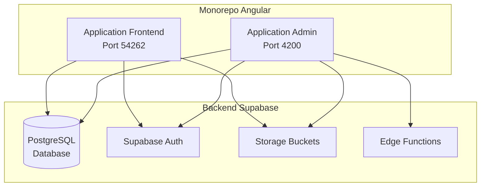
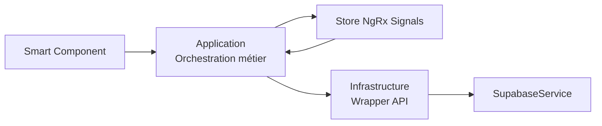
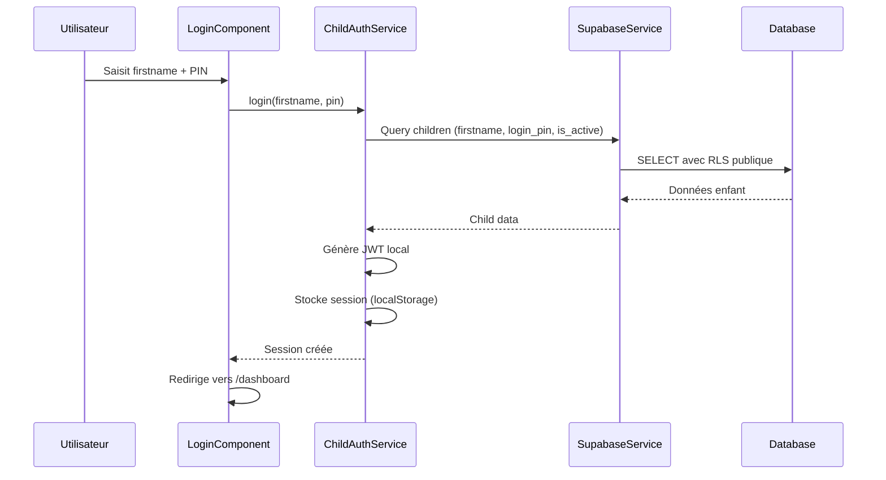
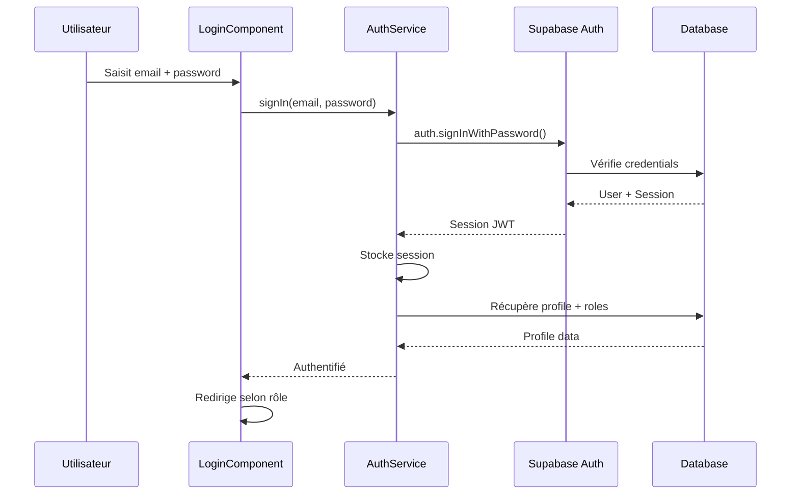
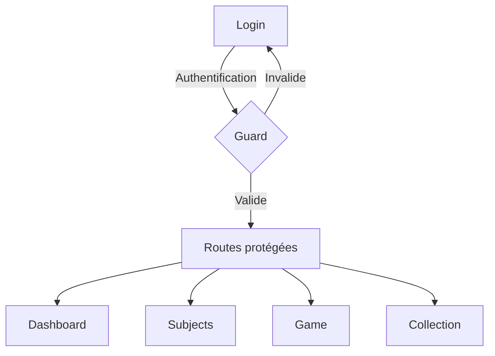
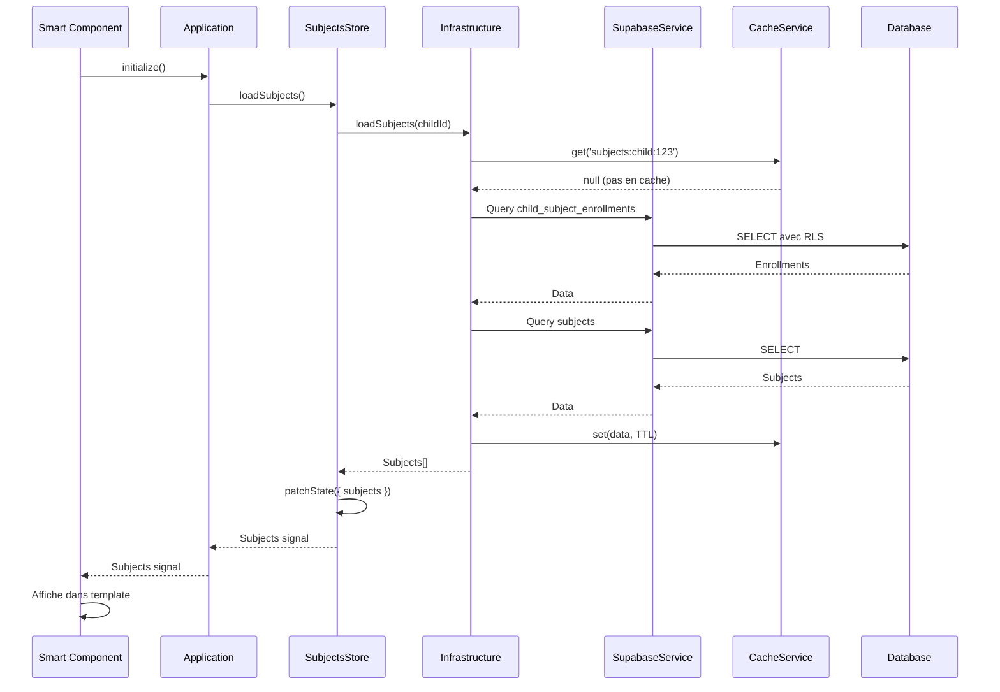

# Architecture de l'Application

## Vue d'ensemble

L'application est un monorepo Angular avec deux applications distinctes partageant la même base de données Supabase :

- **Frontend** (`projects/frontend/`) : Application pour enfants (port 54262)
- **Admin** (`projects/admin/`) : Application pour parents, professeurs et administrateurs (port 4200)

## Structure globale



## Architecture des applications

### Pattern général

Les deux applications suivent la même architecture modulaire :

```
src/app/
├── core/              # Services globaux, authentification, types
│   ├── auth/         # Services et guards d'authentification
│   ├── services/     # Services métier globaux
│   ├── types/        # Types TypeScript partagés
│   └── tokens/       # Tokens d'injection (DI)
├── features/         # Features autonomes
│   └── [feature-name]/
│       ├── [feature].component.ts    # Smart Component
│       ├── components/
│       │   ├── application/          # Orchestration métier
│       │   └── infrastructure/       # Wrapper API
│       ├── store/                     # Store NgRx Signals
│       ├── services/                  # Services métier de la feature
│       └── types/                     # Types spécifiques
└── shared/            # Composants, directives, pipes, utilitaires
    ├── components/   # Composants réutilisables
    ├── animations/    # Animations Angular
    └── utils/         # Utilitaires
```

### Pattern Smart Component + Application/Infrastructure

Chaque feature utilise ce pattern pour séparer les responsabilités :



**Exemple concret** : Feature Subjects

- **Smart Component** : `subjects.component.ts` - Point d'entrée, template HTML
- **Application** : `components/application/application.ts` - Logique métier, orchestration
- **Infrastructure** : `components/infrastructure/infrastructure.ts` - Appels Supabase, cache
- **Store** : `store/index.ts` - État réactif avec NgRx Signals

## Application Frontend

### Structure détaillée

```
projects/frontend/src/app/
├── core/
│   ├── auth/
│   │   ├── child-auth.service.ts      # Authentification enfant (firstname + PIN)
│   │   └── child-auth.guard.ts         # Guard de protection des routes
│   ├── services/
│   │   ├── supabase/                  # Service Supabase avec gestion d'erreurs
│   │   ├── badges/                    # Services de badges
│   │   ├── progression/               # Calcul de progression
│   │   ├── mascot/                     # Gestion de la mascotte
│   │   ├── adaptive-difficulty/        # Adaptation de la difficulté
│   │   ├── save/                       # Sauvegarde automatique
│   │   ├── sync/                       # Synchronisation
│   │   ├── sounds/                     # Sons et feedback audio
│   │   ├── themes/                     # Thèmes personnalisables
│   │   └── ...
│   ├── types/
│   │   ├── badge.types.ts             # Types de badges
│   │   ├── game.types.ts               # Types de jeux
│   │   └── child-session.ts            # Session enfant
│   └── tokens/
│       └── environment.token.ts        # Token d'injection pour environment
├── features/
│   ├── dashboard/                     # Tableau de bord
│   ├── subjects/                      # Matières et sous-catégories
│   ├── game/                          # Interface de jeu
│   ├── collection/                    # Collection (badges, collectibles)
│   ├── settings/                      # Paramètres
│   ├── bonus-games/                   # Jeux bonus
│   └── login/                         # Connexion enfant
└── shared/
    ├── components/                    # Composants réutilisables
    │   ├── app-layout/                # Layout principal
    │   ├── badge-visual/              # Affichage de badges
    │   ├── mascot/                    # Composant mascotte
    │   ├── progress-bar/              # Barre de progression
    │   └── ...
    ├── animations/                     # Animations
    └── utils/                         # Utilitaires
```

### Flux d'authentification Frontend



### Stores NgRx Signals Frontend

Chaque feature a son propre store :

- **DashboardStore** : Statistiques, collectibles récents
- **SubjectsStore** : Matières, sous-catégories, progression
- **GameStore** : Jeu actuel, état de jeu, tentatives
- **CollectionStore** : Badges, collectibles, thèmes
- **SettingsStore** : Paramètres de l'enfant
- **BadgesStore** : Badges débloqués
- **BonusGamesStore** : Jeux bonus disponibles et débloqués

**Exemple de store** :

```typescript
export const GameStore = signalStore(
  { providedIn: 'root' },
  withDevtools('game'),
  withState(initialState),
  withComputed((state) => ({
    hasGame: () => state.currentGame() !== null,
    progress: () => {
      const gameState = state.gameState();
      if (!gameState || gameState.questions.length === 0) return 0;
      return Math.round(((gameState.currentQuestionIndex + 1) / gameState.questions.length) * 100);
    },
  })),
  withMethods((store, infrastructure = inject(GameInfrastructure)) => ({
    loadGame: rxMethod<string>(/* ... */),
    saveAttempt: rxMethod<Partial<any>>(/* ... */),
  }))
);
```

### Routing Frontend

```typescript
// app.routes.ts
export const routes: Routes = [
  {
    path: 'login',
    loadComponent: () => import('./features/login/login.component').then(m => m.LoginComponent),
  },
  {
    path: '',
    loadComponent: () => import('./shared/components/app-layout/app-layout.component').then(m => m.AppLayoutComponent),
    canActivate: [childAuthGuard],  // Protection globale
    children: [
      {
        path: 'dashboard',
        loadComponent: () => import('./features/dashboard/dashboard.component').then(m => m.DashboardComponent),
      },
      {
        path: 'subjects',
        loadComponent: () => import('./features/subjects/subjects.component').then(m => m.SubjectsComponent),
      },
      {
        path: 'game/:id',
        loadComponent: () => import('./features/game/game.component').then(m => m.GameComponent),
      },
      // ...
    ],
  },
];
```

## Application Admin

### Structure détaillée

```
projects/admin/src/app/
├── core/
│   ├── auth/
│   │   ├── core/                      # Service auth core
│   │   ├── profile/                   # Gestion des profils
│   │   └── role/                      # Gestion des rôles
│   └── version.ts                     # Gestion de version
├── features/
│   ├── login/                         # Authentification Supabase
│   ├── dashboard/                     # Tableau de bord
│   ├── parent/                        # Gestion parent
│   ├── child/                         # Gestion enfants
│   ├── teacher/                       # Gestion professeurs
│   └── ...
└── shared/
    ├── components/                    # Composants partagés
    ├── services/                      # Services partagés
    │   ├── supabase/                  # Service Supabase
    │   ├── error-handler/             # Gestion d'erreurs
    │   ├── toast/                     # Notifications
    │   └── ...
    ├── store/                         # Stores NgRx Signals partagés
    │   ├── enrollments.store.ts       # Inscriptions
    │   ├── schools.store.ts           # Écoles
    │   ├── subjects.store.ts          # Matières
    │   └── subject-categories.store.ts # Sous-catégories
    └── interceptors/                  # Intercepteurs HTTP
        └── http-error.interceptor.ts  # Gestion erreurs HTTP
```

### Flux d'authentification Admin



### Stores NgRx Signals Admin

Stores partagés entre features :

- **EnrollmentsStore** : Inscriptions enfants ↔ matières
- **SchoolsStore** : Écoles et années scolaires
- **SubjectsStore** : Matières disponibles
- **SubjectCategoriesStore** : Sous-catégories de matières

### Routing Admin

```typescript
// app.routes.ts
export const routes: Routes = [
  {
    path: 'login',
    loadComponent: () => import('./features/login/login.component').then(m => m.LoginComponent)
  },
  {
    path: 'dashboard',
    loadComponent: () => import('./features/dashboard/dashboard.component').then(m => m.DashboardComponent),
    canActivate: [authGuard]  // Protection Supabase
  },
  {
    path: 'child-profile/:id',
    loadComponent: () => import('./features/child/child.component').then(m => m.ChildComponent),
    canActivate: [authGuard, childParentGuard]  // Vérifie parent/enfant
  },
  // ...
];
```

## Services d'API

### SupabaseService

Service central pour toutes les interactions avec Supabase.

**Localisation** :
- Frontend : `projects/frontend/src/app/core/services/supabase/supabase.service.ts`
- Admin : `projects/admin/src/app/shared/services/supabase/supabase.service.ts`

**Fonctionnalités** :
- Création du client Supabase
- Interception des erreurs d'authentification
- Ajout automatique du JWT aux requêtes (frontend)
- Wrapper `executeWithErrorHandling()` pour gestion d'erreurs

**Exemple d'utilisation** :

```typescript
// Dans Infrastructure
const { data, error } = await this.supabase.client
  .from('games')
  .select('*')
  .eq('subject_category_id', categoryId);

if (error) throw error;
return data || [];
```

### Services métier globaux

#### Frontend

- **BadgesService** : Gestion des badges, notifications
- **ProgressionService** : Calcul de progression (étoiles, pourcentage)
- **MascotService** : Gestion de la mascotte (niveau, XP, évolution)
- **AdaptiveDifficultyService** : Adaptation de la difficulté selon performances
- **AutoSaveService** : Sauvegarde automatique
- **CheckpointService** : Points de sauvegarde
- **SyncService** : Synchronisation avec Supabase
- **SoundService** : Sons et feedback audio
- **ThemesService** : Thèmes personnalisables
- **TutorialService** : Tutoriel interactif
- **StatisticsService** : Statistiques de l'enfant
- **CollectionService** : Gestion de la collection
- **BonusGamesService** : Jeux bonus

#### Admin

- **ErrorHandlerService** : Normalisation et gestion d'erreurs
- **ToastService** : Notifications toast
- **ConfirmationDialogService** : Dialogs de confirmation
- **CacheService** : Cache en mémoire
- **LoggerService** : Logging structuré

## Guards

### Frontend

#### childAuthGuard

**Localisation** : `projects/frontend/src/app/core/auth/child-auth.guard.ts`

**Rôle** : Protège toutes les routes nécessitant une session enfant valide.

**Logique** :
1. Vérifie la session via `ChildAuthService.isSessionValid()`
2. Vérifie présence, expiration, validité JWT, activité
3. Met à jour l'activité si session valide
4. Redirige vers `/login` si session invalide

**Utilisation** :
```typescript
{
  path: '',
  canActivate: [childAuthGuard],  // Protection globale
  children: [/* routes protégées */]
}
```

### Admin

#### authGuard

**Localisation** : `projects/admin/src/app/features/login/guards/auth.guard.ts`

**Rôle** : Vérifie l'authentification Supabase.

**Logique** :
1. Vérifie la session Supabase
2. Redirige vers `/login` si non authentifié

#### childParentGuard

**Localisation** : `projects/admin/src/app/features/child/guards/child-parent.guard.ts`

**Rôle** : Vérifie que l'enfant appartient au parent connecté.

**Logique** :
1. Récupère l'enfant depuis la route (`:id`)
2. Vérifie la relation parent/enfant via RLS
3. Redirige si pas de relation

## Interceptors

### httpErrorInterceptor (Admin)

**Localisation** : `projects/admin/src/app/shared/interceptors/http-error.interceptor.ts`

**Rôle** : Intercepte toutes les erreurs HTTP et les affiche via ErrorSnackbarService.

**Fonctionnalités** :
- Normalise les erreurs HTTP
- Messages conviviaux selon le code HTTP (401, 403, 500, etc.)
- Affichage dans snackbar
- Logging pour debugging

**Configuration** :
```typescript
// app.config.ts
provideHttpClient(
  withInterceptors([httpErrorInterceptor])
)
```

## Gestion d'état (NgRx Signals)

### Pattern utilisé

Tous les stores utilisent NgRx Signals avec ce pattern :

```typescript
export const FeatureStore = signalStore(
  { providedIn: 'root' },
  withDevtools('feature-name'),
  withState(initialState),
  withComputed((state) => ({
    // Valeurs calculées
  })),
  withMethods((store, infrastructure = inject(Infrastructure)) => ({
    // Actions et méthodes
  }))
);
```

### Avantages

- **Réactivité** : Mise à jour automatique des composants
- **Performance** : Computed signals optimisés
- **DevTools** : Support Redux DevTools
- **Type-safe** : TypeScript complet
- **Lazy** : Injection à la demande

### Stores par application

#### Frontend (un par feature)

- `DashboardStore` : État du dashboard
- `SubjectsStore` : Matières et sous-catégories sélectionnées
- `GameStore` : Jeu actuel et état de jeu
- `CollectionStore` : Collection de l'enfant
- `SettingsStore` : Paramètres
- `BadgesStore` : Badges débloqués
- `BonusGamesStore` : Jeux bonus

#### Admin (stores partagés)

- `EnrollmentsStore` : Inscriptions enfants ↔ matières
- `SchoolsStore` : Écoles et années scolaires
- `SubjectsStore` : Matières
- `SubjectCategoriesStore` : Sous-catégories

## Routing et Lazy Loading

### Lazy Loading

Tous les composants sont chargés à la demande :

```typescript
loadComponent: () => 
  import('./features/game/game.component')
    .then(m => m.GameComponent)
```

**Avantages** :
- Réduction de la taille du bundle initial
- Chargement à la demande
- Meilleure performance

### Routes protégées



## Tokens d'injection (Dependency Injection)

### ENVIRONMENT token

**Localisation** :
- Frontend : `projects/frontend/src/app/core/tokens/environment.token.ts`
- Admin : `projects/admin/src/app/shared/tokens/environment.token.ts`

**Usage** : Injection de l'environment sans dépendance circulaire.

```typescript
export const ENVIRONMENT = new InjectionToken<Environment>('ENVIRONMENT');

// Dans app.config.ts
provide(ENVIRONMENT, { useValue: environment })
```

## Cache

### CacheService

**Localisation** : `projects/frontend/src/app/core/services/cache/cache.service.ts`

**Rôle** : Cache en mémoire avec expiration.

**Utilisation** :
```typescript
const cacheKey = 'subjects:child:123';
const cached = this.cache.get<Subject[]>(cacheKey);
if (cached) return cached;

// ... fetch data ...
this.cache.set(cacheKey, data, 10 * 60 * 1000); // 10 minutes
```

## Flux de données typique

### Exemple : Charger les matières



## Notes importantes

1. **Séparation des responsabilités** : Application (métier) vs Infrastructure (API)
2. **Stores réactifs** : Utiliser les signals pour l'état partagé
3. **Lazy loading** : Tous les composants sont chargés à la demande
4. **RLS** : Les permissions sont gérées au niveau base de données
5. **Cache** : Utiliser le CacheService pour les données fréquemment accédées
6. **Error handling** : Toujours gérer les erreurs dans Infrastructure
