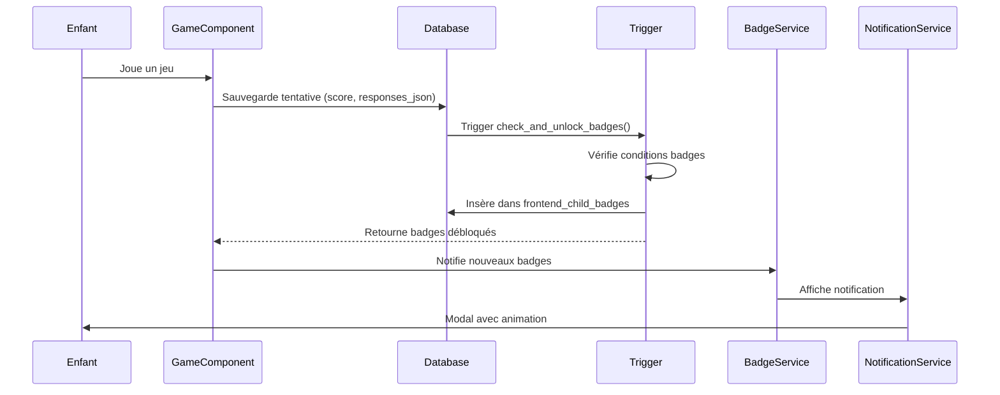

# Système de badges

## Vue d'ensemble

Le système de badges récompense les enfants pour leurs accomplissements dans l'application. Les badges sont débloqués automatiquement via des triggers PostgreSQL après chaque action pertinente (tentative de jeu, complétion de catégorie, etc.).

**Caractéristiques principales** :
- Déblocage automatique via triggers PostgreSQL
- Système de niveaux avec progression dynamique (seuils croissants)
- Un même badge peut être débloqué plusieurs fois à différents niveaux
- Notifications visuelles lors du déblocage

## Tables du système

### `frontend_badges` - Catalogue des badges

**Rôle** : Définit tous les badges disponibles dans l'application.

**Structure** :
```typescript
interface Badge {
  id: string;
  name: string;              // Nom du badge (ex: "Première catégorie complétée")
  description?: string;       // Description du badge
  badge_type: string;         // Type unique (voir types ci-dessous)
  icon_url?: string;         // URL de l'icône
  color_code?: string;        // Code couleur pour l'affichage
  image_url?: string;        // URL de l'image
  is_active: boolean;         // Badge actif (peut être désactivé)
  created_at: string;
  updated_at: string;
}
```

**Types de badges** :
- `first_category_complete` : Première catégorie complétée
- `first_subject_complete` : Première matière complétée
- `first_game_perfect` : Premier jeu parfait du 1er coup
- `daily_streak_responses` : Réponses quotidiennes (5+ ou 7+)
- `consecutive_correct` : Réponses consécutives correctes (5 ou 7)
- `perfect_games_count` : Jeux parfaits cumulatifs (10 ou 13)
- `consecutive_game_days` : Jours consécutifs de jeu (avec niveaux progressifs)
- `daily_activity` : Activité quotidienne (temps de jeu + nombre de jeux)

### `frontend_child_badges` - Badges débloqués

**Rôle** : Historique des badges débloqués par chaque enfant avec niveau et valeur.

**Structure** :
```typescript
interface ChildBadge {
  id: string;
  child_id: string;
  badge_id: string;
  unlocked_at: string;       // Date de déblocage
  level: number;              // Niveau de déblocage (1, 2, 3, ...)
  value: number;              // Valeur obtenue (ex: 10 jeux parfaits)
  created_at: string;
}
```

**Contrainte UNIQUE** : `(child_id, badge_id, level)` - Permet plusieurs déblocages du même badge à différents niveaux.

### `frontend_badge_levels` - Niveaux de progression

**Rôle** : Suit le niveau actuel de progression pour chaque type de badge et chaque enfant.

**Structure** :
```typescript
interface BadgeLevel {
  id: string;
  child_id: string;
  badge_type: string;         // Type de badge
  current_level: number;       // Niveau actuel (1, 2, 3, ...)
  last_unlocked_at?: string;  // Date du dernier déblocage
  created_at: string;
  updated_at: string;
}
```

**Contrainte UNIQUE** : `(child_id, badge_type)` - Un niveau par type de badge et par enfant.

## Types de badges et conditions de déblocage

### Badge 1 : Première catégorie complétée

**Type** : `first_category_complete`

**Condition** :
- Une sous-catégorie atteint 100% de complétion (`completion_percentage >= 100`)
- C'est la première catégorie complétée par l'enfant

**Déblocage** : Automatique via trigger après mise à jour de `frontend_subject_category_progress`.

**Niveaux** : Un seul niveau (non récurrent).

**Valeur** : `100` (pourcentage de complétion).

### Badge 2 : Première matière complétée

**Type** : `first_subject_complete`

**Condition** :
- Toutes les sous-catégories d'une matière sont complétées (100%)
- La matière doit avoir au moins une sous-catégorie
- C'est la première matière complétée par l'enfant

**Déblocage** : Automatique via trigger après complétion de la dernière sous-catégorie.

**Niveaux** : Un seul niveau (non récurrent).

**Valeur** : Nombre de sous-catégories complétées.

### Badge 3 : Premier jeu parfait du 1er coup

**Type** : `first_game_perfect`

**Condition** :
- Un jeu est réussi à 100% (`score = 100`)
- C'est la première tentative de ce jeu pour cette catégorie
- Le jeu doit être lié à une sous-catégorie

**Déblocage** : Automatique via trigger après sauvegarde d'une tentative avec score = 100%.

**Tracking** : Table `frontend_first_perfect_games` pour éviter les doublons.

**Niveaux** : Un seul niveau (non récurrent).

**Valeur** : `100` (score).

### Badge 4 : Réponses quotidiennes (5+)

**Type** : `daily_streak_responses`

**Condition** :
- 5+ bonnes réponses dans la même journée
- Badge récurrent (peut être débloqué plusieurs fois, une fois par jour)

**Déblocage** : Automatique via trigger `track_daily_and_consecutive_responses()` après chaque tentative.

**Tracking** : Table `frontend_daily_responses` avec compteur quotidien.

**Niveaux** : Système de niveaux avec seuils dynamiques.

**Seuils par niveau** :
- Niveau 1 : 5 réponses (base)
- Niveau 2 : 6.5 → 7 réponses (arrondi)
- Niveau 3 : 8.45 → 8 réponses
- Niveau 4 : 10.985 → 11 réponses
- Etc. (formule : `base × 1.3^(niveau-1)`)

**Valeur** : Nombre de bonnes réponses du jour.

### Badge 4.1 : Réponses quotidiennes (7+)

**Type** : `daily_streak_responses` (variante avec seuil 7)

**Condition** :
- 7+ bonnes réponses dans la même journée
- Badge récurrent

**Seuils par niveau** :
- Niveau 1 : 7 réponses (base)
- Niveau 2 : 9.1 → 9 réponses
- Niveau 3 : 11.83 → 12 réponses
- Etc.

### Badge 5 : Réponses consécutives correctes (5)

**Type** : `consecutive_correct`

**Condition** :
- 5 réponses correctes consécutives (sans erreur)
- Le compteur est réinitialisé à 0 en cas d'erreur

**Déblocage** : Automatique via trigger `track_daily_and_consecutive_responses()` après chaque tentative.

**Tracking** : Table `frontend_consecutive_responses` avec compteur `consecutive_count`.

**Niveaux** : Système de niveaux avec seuils dynamiques.

**Seuils par niveau** :
- Niveau 1 : 5 réponses (base)
- Niveau 2 : 6.5 → 7 réponses
- Niveau 3 : 8.45 → 8 réponses
- Etc.

**Valeur** : Nombre de réponses consécutives obtenues.

### Badge 5.1 : Réponses consécutives correctes (7)

**Type** : `consecutive_correct` (variante avec seuil 7)

**Condition** :
- 7 réponses correctes consécutives
- Compteur séparé dans `consecutive_7_count`

**Seuils par niveau** :
- Niveau 1 : 7 réponses (base)
- Niveau 2 : 9.1 → 9 réponses
- Etc.

### Badge 6 : Jeux parfaits cumulatifs (10)

**Type** : `perfect_games_count`

**Condition** :
- 10 jeux uniques réussis à 100% (meilleur score = 100%)
- Un jeu est compté une seule fois même s'il est réussi plusieurs fois

**Déblocage** : Automatique via trigger `track_daily_and_consecutive_responses()` après chaque tentative parfaite.

**Tracking** : Table `frontend_perfect_games_count` avec compteur `total_perfect_games`.

**Niveaux** : Système de niveaux avec seuils dynamiques.

**Seuils par niveau** :
- Niveau 1 : 10 jeux (base)
- Niveau 2 : 13 jeux
- Niveau 3 : 16.9 → 17 jeux
- Etc.

**Valeur** : Nombre total de jeux parfaits.

### Badge 6.1 : Jeux parfaits cumulatifs (13)

**Type** : `perfect_games_count` (variante avec seuil 13)

**Condition** :
- 13 jeux uniques réussis à 100%

**Seuils par niveau** :
- Niveau 1 : 13 jeux (base)
- Niveau 2 : 16.9 → 17 jeux
- Etc.

### Badge 7 : Jours consécutifs de jeu

**Type** : `consecutive_game_days`

**Condition** :
- Jouer plusieurs jours consécutifs
- Formule : **Niveau = Jours Consécutifs - 1**
- Niveau 1 : 2 jours consécutifs
- Niveau 2 : 3 jours consécutifs
- Niveau 3 : 4 jours consécutifs
- Etc.

**Déblocage** : Automatique via trigger `trigger_update_consecutive_game_days` après chaque tentative de jeu.

**Tracking** : Table `frontend_consecutive_game_days` avec `current_streak`, `max_streak`, `current_level`.

**Règles** :
- Deux jours sont consécutifs s'ils se suivent directement (lundi → mardi)
- La série doit se terminer aujourd'hui ou hier pour rester active
- Si plus d'un jour sans jeu → série réinitialisée à 0
- Supprimer les doublons (pas compter 2 fois si l'enfant joue 2x le même jour)
- Si pas de jeu depuis 2 jours → niveau revient à 0
- Peut rejouer le même jour → pas d'impact sur la série
- Les niveaux une fois débloqués restent dans l'historique
- Tracker la meilleure série atteinte (`max_streak`) séparément

**Optimisation performance** :
- **Même jour** : Skip le calcul (pas de changement possible)
- **Jour suivant** : Incrément simple (pas de recalcul complet)
- **Gap > 1 jour** : Recalcul complet (nécessaire pour détecter les gaps)

**Niveaux** : Système de niveaux progressifs (un niveau par jour consécutif supplémentaire).

**Valeur** : Nombre de jours consécutifs obtenus.

### Badge 8 : Activité Quotidienne

**Type** : `daily_activity`

**Condition** :
- Combiner temps de jeu actif (minutes) ET nombre de jeux complétés dans la même journée
- Les deux conditions doivent être remplies simultanément (ET logique)
- Badge récurrent (peut être débloqué plusieurs fois, une fois par jour)

**Formule des niveaux** :
- **Niveau N** : `Temps = 30 + (N-1) × 5` minutes **ET** `Jeux = 3 + (N-1) × 1` jeux
- Niveau 1 : 30 minutes ET 3 jeux
- Niveau 2 : 35 minutes ET 4 jeux
- Niveau 3 : 40 minutes ET 5 jeux
- Niveau 4 : 45 minutes ET 6 jeux
- Etc.

**Déblocage** : Automatique via trigger `trigger_update_daily_activity_badge` après chaque tentative de jeu.

**Tracking** : Table `frontend_daily_activity_tracking` avec :
- `total_active_minutes` : Temps total de jeu actif du jour (calculé depuis `duration_ms` des tentatives)
- `total_games_completed` : Nombre de jeux complétés du jour
- `max_level_daily` : Niveau maximal atteint aujourd'hui
- `activity_date` : Date de l'activité
- `last_check_date` : Dernière date de vérification

**Calcul du temps actif** :
- Somme des durées de toutes les tentatives complétées du jour
- Durée = `EXTRACT(EPOCH FROM (completed_at - started_at)) / 60` (en minutes, arrondi)
- Ignore les durées négatives (anomalies)

**Règles** :
- Le badge est calculé et débloqué automatiquement après chaque tentative de jeu
- Tous les niveaux atteints dans la journée sont débloqués simultanément (1 à N)
- Le badge peut être redébloqué chaque jour (récurrent)
- Les niveaux sont débloqués uniquement si les deux conditions sont remplies (temps ET jeux)

**Niveaux** : Système de niveaux progressifs avec seuils croissants pour temps et jeux.

**Valeur** : Objet JSONB avec `{ minutes, games, level }` stockant les valeurs obtenues.

**Fonctions SQL** :
- `calculate_daily_activity_badge(p_child_id, p_game_date)` : Calcule les compteurs du jour
- `determine_max_daily_level(p_total_minutes, p_total_games)` : Détermine le niveau maximal atteint
- `unlock_daily_activity_levels(...)` : Débloque les niveaux du badge
- `calculate_and_unlock_daily_activity_badge(p_child_id, p_game_date)` : Calcule et débloque en une seule opération
- `get_daily_activity_status(p_child_id, p_game_date)` : Récupère l'état complet du badge

**Service Frontend** : `DailyActivityService` dans `projects/frontend/src/app/core/services/badges/daily-activity.service.ts`

## Système de niveaux et progression dynamique

### Formule de calcul des seuils

Les seuils augmentent de 30% à chaque niveau :

```sql
seuil = FLOOR(base × 1.3^(niveau-1))
```

**Exemple pour Badge 5 (base = 5)** :
- Niveau 1 : `FLOOR(5 × 1.3^0) = 5`
- Niveau 2 : `FLOOR(5 × 1.3^1) = 6.5 → 6` (arrondi)
- Niveau 3 : `FLOOR(5 × 1.3^2) = 8.45 → 8`
- Niveau 4 : `FLOOR(5 × 1.3^3) = 10.985 → 10`
- Niveau 5 : `FLOOR(5 × 1.3^4) = 14.28 → 14`

### Fonction SQL : `calculate_badge_threshold()`

```sql
CREATE OR REPLACE FUNCTION calculate_badge_threshold(
  base_value INTEGER,
  current_level INTEGER
) RETURNS INTEGER AS $$
BEGIN
  RETURN FLOOR(base_value * POWER(1.3, current_level - 1))::INTEGER;
END;
$$ LANGUAGE plpgsql;
```

### Progression automatique

1. **Vérification du seuil** : Après chaque action pertinente, le système vérifie si le seuil du niveau actuel est atteint
2. **Déblocage** : Si oui, le badge est débloqué au niveau actuel
3. **Incrémentation** : Le niveau est incrémenté dans `frontend_badge_levels`
4. **Nouveau seuil** : Le prochain seuil est calculé avec la formule

## Triggers PostgreSQL

### Trigger : Déblocage après tentative de jeu

**Fonction** : `check_and_unlock_badges()`

**Déclenchement** : Après insertion dans `frontend_game_attempts`

**Badges vérifiés** :
- Badge 1 : Première catégorie complétée
- Badge 2 : Première matière complétée
- Badge 3 : Premier jeu parfait du 1er coup

**Paramètres** :
```sql
check_and_unlock_badges(
  p_child_id UUID,
  p_game_id UUID,
  p_score INTEGER,
  p_responses_json JSONB
)
```

**Retour** : Table avec les badges débloqués :
```sql
RETURNS TABLE (
  badge_id UUID,
  badge_name TEXT,
  badge_type TEXT,
  level INTEGER,
  value INTEGER
)
```

### Trigger : Tracking des réponses

**Fonction** : `track_daily_and_consecutive_responses()`

**Déclenchement** : Après insertion dans `frontend_game_attempts`

**Badges vérifiés** :
- Badge 4 : Réponses quotidiennes (5+)
- Badge 4.1 : Réponses quotidiennes (7+)
- Badge 5 : Réponses consécutives (5)
- Badge 5.1 : Réponses consécutives (7)
- Badge 6 : Jeux parfaits cumulatifs (10)
- Badge 6.1 : Jeux parfaits cumulatifs (13)

### Trigger : Badge Activité Quotidienne

**Fonction** : `update_daily_activity_badge_trigger()`

**Déclenchement** : Après insertion dans `frontend_game_attempts`

**Badge vérifié** :
- Badge 8 : Activité Quotidienne (temps de jeu + nombre de jeux)

**Logique** :
1. Calcule le temps actif total et le nombre de jeux complétés du jour
2. Détermine le niveau maximal atteint selon les deux critères
3. Débloque tous les niveaux de 1 à N si les conditions sont remplies
4. Met à jour `frontend_daily_activity_tracking`

**Paramètres** :
```sql
track_daily_and_consecutive_responses(
  p_child_id UUID,
  p_game_attempt_id UUID,
  p_responses_json JSONB,
  p_game_id UUID,
  p_score INTEGER
)
```

**Logique** :
1. Compter les bonnes réponses dans `p_responses_json`
2. Mettre à jour `frontend_daily_responses` (compteur quotidien)
3. Mettre à jour `frontend_consecutive_responses` (compteur consécutif, réinitialisé en cas d'erreur)
4. Mettre à jour `frontend_perfect_games_count` (si score = 100%)
5. Vérifier les seuils et débloquer les badges si nécessaire

## Tables de tracking

### `frontend_first_perfect_games`

**Rôle** : Suit les jeux réussis à 100% en première tentative pour chaque catégorie.

**Structure** :
```typescript
interface FirstPerfectGame {
  id: string;
  child_id: string;
  subject_category_id: string;
  game_id: string;
  attempted_at: string;
  created_at: string;
}
```

**Utilisation** : Évite de compter plusieurs fois le même jeu parfait pour le Badge 3.

### `frontend_daily_responses`

**Rôle** : Suit les bonnes réponses quotidiennes pour chaque enfant.

**Structure** :
```typescript
interface DailyResponse {
  id: string;
  child_id: string;
  response_date: Date;              // Date UTC
  correct_responses_count: number;  // Compteur du jour
  badge_4_unlocked: boolean;        // Badge 4 débloqué aujourd'hui
  badge_4_1_unlocked: boolean;       // Badge 4.1 débloqué aujourd'hui
  created_at: string;
  updated_at: string;
}
```

**Utilisation** : Compteur quotidien réinitialisé chaque jour (UTC).

### `frontend_consecutive_responses`

**Rôle** : Suit les réponses consécutives correctes.

**Structure** :
```typescript
interface ConsecutiveResponse {
  id: string;
  child_id: string;
  consecutive_count: number;        // Compteur pour Badge 5 (seuil 5)
  consecutive_7_count: number;     // Compteur pour Badge 5.1 (seuil 7)
  last_response_date: string;
  created_at: string;
  updated_at: string;
}
```

**Logique** :
- `consecutive_count` : Incrémenté si réponse correcte, réinitialisé à 0 si erreur
- `consecutive_7_count` : Même logique mais pour le seuil 7

### `frontend_perfect_games_count`

**Rôle** : Suit le nombre total de jeux uniques réussis à 100%.

**Structure** :
```typescript
interface PerfectGamesCount {
  id: string;
  child_id: string;
  total_perfect_games: number;      // Nombre total de jeux parfaits uniques
  badge_6_unlocked: boolean;        // Badge 6 débloqué
  badge_6_1_unlocked: boolean;      // Badge 6.1 débloqué
  created_at: string;
  updated_at: string;
}
```

**Logique** :
- Un jeu est compté une seule fois (meilleur score = 100%)
- Le compteur est incrémenté uniquement si le jeu n'a pas encore été compté

### `frontend_daily_activity_tracking`

**Rôle** : Suit l'activité quotidienne (temps de jeu et nombre de jeux) pour chaque enfant et chaque jour.

**Structure** :
```typescript
interface DailyActivityTracking {
  id: string;
  child_id: string;
  activity_date: Date;              // Date de l'activité (DATE uniquement)
  total_active_minutes: number;     // Temps total de jeu actif du jour (en minutes)
  total_games_completed: number;    // Nombre de jeux complétés du jour
  max_level_daily: number;          // Niveau maximal atteint aujourd'hui
  last_check_date: Date;           // Dernière date de vérification
  created_at: string;
  updated_at: string;
}
```

**Logique** :
- Une entrée par enfant et par jour (contrainte UNIQUE sur `child_id, activity_date`)
- Le temps actif est calculé depuis `duration_ms` des tentatives complétées
- Les niveaux sont débloqués automatiquement si les conditions sont remplies
- Le badge peut être redébloqué chaque jour (récurrent)

## Affichage et notifications

### Service : BadgesService

**Localisation** : `projects/frontend/src/app/core/services/badges/badges.service.ts`

**Fonctionnalités** :
- Chargement des badges disponibles
- Chargement des badges débloqués par enfant
- Notification des nouveaux badges débloqués

### Service : ConsecutiveGameDaysService

**Localisation** : `projects/frontend/src/app/core/services/badges/consecutive-game-days.service.ts`

**Fonctionnalités** :
- Récupération de l'état des jours consécutifs
- Recalcul et déblocage automatique des badges
- Vérification des badges nouvellement débloqués (comparaison avant/après)

### Service : DailyActivityService

**Localisation** : `projects/frontend/src/app/core/services/badges/daily-activity.service.ts`

**Fonctionnalités** :
- Récupération de l'état de l'activité quotidienne
- Recalcul et déblocage automatique des niveaux
- Calcul des exigences par niveau
- Détection des nouveaux niveaux débloqués

### Service : BadgeNotificationService

**Localisation** : `projects/frontend/src/app/core/services/badges/badge-notification.service.ts`

**Fonctionnalités** :
- Affichage de notifications visuelles lors du déblocage
- Modal de notification avec animation
- Son de notification (optionnel)
- Gestion de la file d'attente des notifications

### Composant : BadgeVisual

**Localisation** : `projects/frontend/src/app/shared/components/badge-visual/badge-visual.component.ts`

**Rôle** : Affichage visuel d'un badge avec icône, couleur et niveau.

### Composant : BadgeNotificationModal

**Localisation** : `projects/frontend/src/app/shared/components/badge-notification-modal/badge-notification-modal.component.ts`

**Rôle** : Modal affichée lors du déblocage d'un nouveau badge.

## Flux de déblocage



## Bonnes pratiques

1. **Ne pas débloquer manuellement** : Les badges sont débloqués automatiquement via triggers
2. **Respecter les seuils** : Utiliser la fonction `calculate_badge_threshold()` pour les nouveaux badges
3. **Gérer les niveaux** : Toujours incrémenter le niveau après déblocage
4. **Notifications** : Afficher les notifications de manière non intrusive
5. **Performance** : Les index sur les tables de tracking optimisent les requêtes

## Migration et création de nouveaux badges

### Créer un nouveau badge

1. **Insérer dans `frontend_badges`** :
```sql
INSERT INTO frontend_badges (name, description, badge_type, icon_url, color_code, is_active)
VALUES ('Nouveau badge', 'Description', 'nouveau_type', 'icon.png', '#FF0000', true);
```

2. **Créer la fonction de vérification** dans un trigger ou une fonction SQL

3. **Ajouter le tracking** si nécessaire (table de tracking dédiée)

4. **Tester** le déblocage avec différents scénarios

### Exemple : Badge personnalisé

```sql
-- 1. Créer le badge
INSERT INTO frontend_badges (name, description, badge_type, is_active)
VALUES ('10 jeux joués', 'Avoir joué 10 jeux', 'games_played_10', true);

-- 2. Ajouter la vérification dans un trigger
-- (exemple simplifié)
IF (SELECT COUNT(*) FROM frontend_game_attempts WHERE child_id = p_child_id) >= 10 THEN
  -- Débloquer le badge
  INSERT INTO frontend_child_badges (child_id, badge_id, level, value)
  VALUES (p_child_id, v_badge_id, 1, 10)
  ON CONFLICT DO NOTHING;
END IF;
```
