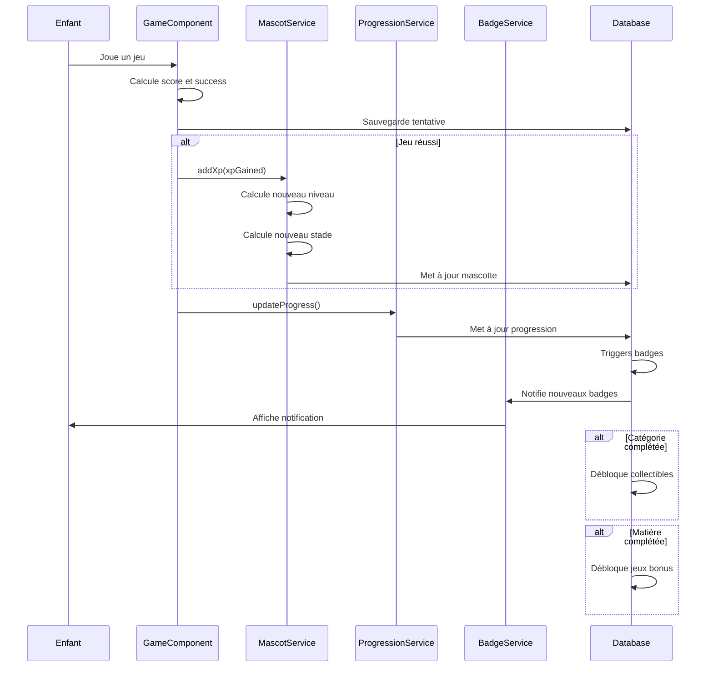

# Gamification : Streaks, XP, Mascotte et Récompenses

## Vue d'ensemble

Le système de gamification motive les enfants à progresser via :
- **Streaks** : Séries de réponses correctes consécutives
- **XP (Points d'expérience)** : Gagnés après chaque jeu réussi
- **Mascotte** : Avatar qui évolue selon le niveau et l'XP
- **Récompenses** : Badges, collectibles, jeux bonus débloqués

## Système de streaks (séries)

### Réponses consécutives correctes

**Table** : `frontend_consecutive_responses`

**Structure** :
```typescript
interface ConsecutiveResponse {
  id: string;
  child_id: string;
  consecutive_count: number;        // Compteur pour seuil 5
  consecutive_7_count: number;      // Compteur pour seuil 7
  last_response_date: string;
  created_at: string;
  updated_at: string;
}
```

**Logique** :
- **Incrémentation** : Si réponse correcte → `consecutive_count++` et `consecutive_7_count++`
- **Réinitialisation** : Si réponse incorrecte → `consecutive_count = 0` et `consecutive_7_count = 0`
- **Déblocage badges** : Badge débloqué quand seuil atteint (5 ou 7)

**Mise à jour** : Automatique via trigger `track_daily_and_consecutive_responses()` après chaque tentative.

### Réponses quotidiennes

**Table** : `frontend_daily_responses`

**Structure** :
```typescript
interface DailyResponse {
  id: string;
  child_id: string;
  response_date: Date;              // Date UTC
  correct_responses_count: number;  // Compteur du jour
  badge_4_unlocked: boolean;        // Badge 4 débloqué aujourd'hui
  badge_4_1_unlocked: boolean;      // Badge 4.1 débloqué aujourd'hui
  created_at: string;
  updated_at: string;
}
```

**Logique** :
- **Compteur quotidien** : Incrémenté après chaque bonne réponse
- **Réinitialisation** : Nouveau compteur chaque jour (UTC)
- **Badges récurrents** : Peuvent être débloqués plusieurs fois (une fois par jour)

**Mise à jour** : Automatique via trigger après chaque tentative.

## Système XP (Points d'expérience)

### Gain d'XP

**Formule** :
```typescript
calculateXpGain(score: number, maxScore: number, success: boolean): number {
  if (!success) return 0;
  
  const scoreRatio = score / maxScore;
  // Base XP: 10 points
  // Bonus selon le score: jusqu'à 20 points supplémentaires
  return Math.round(10 + scoreRatio * 20);
}
```

**Règles** :
- **Base** : 10 points si jeu réussi (`success = true`)
- **Bonus** : Jusqu'à 20 points supplémentaires selon le score
- **Total** : 10-30 points par jeu réussi
- **Aucun XP** : Si jeu échoué (`success = false`)

**Exemples** :
- Score 100% : `10 + (100/100) × 20 = 30 points`
- Score 80% : `10 + (80/100) × 20 = 26 points`
- Score 50% : `10 + (50/100) × 20 = 20 points`
- Score 0% : `0 points` (jeu échoué)

### Calcul du niveau

**Formule** :
```typescript
calculateLevel(xp: number): number {
  // niveau = floor(sqrt(xp / 100)) + 1
  return Math.floor(Math.sqrt(xp / 100)) + 1;
}
```

**Exemples** :
- XP 0 : Niveau 1
- XP 100 : Niveau 2 (`floor(sqrt(1)) + 1 = 2`)
- XP 400 : Niveau 3 (`floor(sqrt(4)) + 1 = 3`)
- XP 900 : Niveau 4 (`floor(sqrt(9)) + 1 = 4`)
- XP 1600 : Niveau 5 (`floor(sqrt(16)) + 1 = 5`)

**XP nécessaire pour le prochain niveau** :
```typescript
getXpForNextLevel(currentLevel: number): number {
  return Math.pow(currentLevel, 2) * 100;
}
```

**Exemples** :
- Niveau 1 → 2 : `1² × 100 = 100 XP`
- Niveau 2 → 3 : `2² × 100 = 400 XP`
- Niveau 3 → 4 : `3² × 100 = 900 XP`
- Niveau 4 → 5 : `4² × 100 = 1600 XP`

## Mascotte

### Table : `frontend_child_mascot_state`

**Structure** :
```typescript
interface MascotState {
  id: string;
  child_id: string;                // UNIQUE (1:1 avec enfant)
  level: number;                    // Niveau (≥ 1)
  xp: number;                       // Points d'expérience (≥ 0)
  evolution_stage: number;          // Stade d'évolution (1-5)
  current_appearance_json?: {       // Apparence actuelle
    color?: string;
    accessories?: string[];
  };
  last_xp_gain_at?: string;         // Dernière acquisition d'XP
  created_at: string;
  updated_at: string;
}
```

### Stades d'évolution

**Calcul** :
```typescript
calculateEvolutionStage(level: number): number {
  if (level >= 20) return 5;
  if (level >= 15) return 4;
  if (level >= 10) return 3;
  if (level >= 5) return 2;
  return 1;
}
```

**Stades** :
- **Stade 1** : Niveau 1-4
- **Stade 2** : Niveau 5-9
- **Stade 3** : Niveau 10-14
- **Stade 4** : Niveau 15-19
- **Stade 5** : Niveau 20+

### Apparence

L'apparence est stockée dans `current_appearance_json` (JSONB) :

```json
{
  "color": "#FFD700",
  "accessoires": ["chapeau", "lunettes"]
}
```

**Personnalisation** :
- Couleur de la mascotte
- Accessoires débloqués
- Style selon le stade d'évolution

### Service : MascotService

**Localisation** : `projects/frontend/src/app/core/services/mascot/mascot.service.ts`

**Méthodes principales** :

#### `getMascotState()`

Récupère l'état de la mascotte. Crée un état par défaut si inexistant.

#### `addXp()`

Ajoute de l'XP et met à jour automatiquement le niveau et le stade d'évolution :

```typescript
async addXp(childId: string, xpGained: number): Promise<MascotState> {
  const currentState = await this.getMascotState(childId);
  const newXp = currentState.xp + xpGained;
  const newLevel = this.calculateLevel(newXp);
  const newEvolutionStage = this.calculateEvolutionStage(newLevel);

  // Mise à jour dans la base de données
  const { data } = await supabase
    .from('frontend_child_mascot_state')
    .update({
      xp: newXp,
      level: newLevel,
      evolution_stage: newEvolutionStage,
      last_xp_gain_at: new Date().toISOString(),
    })
    .eq('child_id', childId)
    .select()
    .single();

  return data;
}
```

#### `updateAppearance()`

Met à jour l'apparence de la mascotte.

### Composant : Mascot

**Localisation** : `projects/frontend/src/app/shared/components/mascot/mascot.component.ts`

**Fonctionnalités** :
- Affichage de la mascotte selon le stade d'évolution
- Animation lors du gain d'XP
- Affichage du niveau et de l'XP
- Barre de progression vers le prochain niveau

## Récompenses

### Badges

Voir [docs/badges-system.md](badges-system.md) pour les détails complets.

**Types de récompenses** :
- Première catégorie complétée
- Première matière complétée
- Premier jeu parfait
- Réponses quotidiennes (5+ ou 7+)
- Réponses consécutives (5 ou 7)
- Jeux parfaits cumulatifs (10 ou 13)

### Collectibles

**Déblocage** : Automatique quand une sous-catégorie est complétée.

**Structure** :
```typescript
interface Collectible {
  id: string;
  name: string;
  description?: string;
  image_url?: string;
  subject_category_id?: string;    // Lié à une sous-catégorie
  unlock_condition_json?: {        // Conditions de déblocage
    type: "complete_subject_category";
    subject_category_id: string;
  };
  display_order: number;
  is_active: boolean;
}
```

### Jeux bonus

**Déblocage** : Automatique quand toutes les sous-catégories d'une matière sont complétées.

**Structure** :
```typescript
interface BonusGame {
  id: string;
  name: string;
  description?: string;
  subject_id?: string;              // Lié à une matière
  unlock_condition_json: {         // Conditions de déblocage
    type: "complete_subject";
    subject_id: string;
  };
  game_data_json: Record<string, unknown>;  // Données du jeu
  image_url?: string;
  is_active: boolean;
}
```

**Utilisation** :
- Peut être joué plusieurs fois
- Compteur `played_count` pour suivre l'engagement
- Date `last_played_at` pour l'historique

## Flux de gamification



## Calcul des récompenses

### Après chaque jeu

1. **XP** : Ajouté si jeu réussi (10-30 points)
2. **Streaks** : Mis à jour (consécutif et quotidien)
3. **Progression** : Pourcentage et étoiles recalculés
4. **Badges** : Vérification automatique via triggers

### Après complétion de catégorie

1. **Collectibles** : Débloqués automatiquement
2. **Badge** : "Première catégorie complétée" (si première)

### Après complétion de matière

1. **Jeux bonus** : Débloqués automatiquement
2. **Badge** : "Première matière complétée" (si première)

## Affichage des récompenses

### Dashboard

**Localisation** : `projects/frontend/src/app/features/dashboard/`

**Affichage** :
- Mascotte avec niveau et XP
- Barre de progression vers le prochain niveau
- Badges récents débloqués
- Collectibles récents

### Collection

**Localisation** : `projects/frontend/src/app/features/collection/`

**Affichage** :
- Tous les badges débloqués (avec niveaux)
- Tous les collectibles débloqués
- Thèmes débloqués
- Statistiques de progression

### Notifications

**Service** : `BadgeNotificationService`

**Fonctionnalités** :
- Modal avec animation lors du déblocage
- Son de notification (optionnel)
- Affichage non intrusif

## Bonnes pratiques

1. **Gain d'XP immédiat** : Ajouter l'XP dès que le jeu est réussi
2. **Mise à jour automatique** : Utiliser les triggers PostgreSQL pour les badges
3. **Feedback visuel** : Afficher les animations lors du gain d'XP et déblocage
4. **Performance** : Mettre en cache l'état de la mascotte
5. **Persistance** : Sauvegarder toutes les récompenses dans la base de données

## Exemples de calculs

### Exemple 1 : Gain d'XP

**Scénario** : Enfant joue un jeu et obtient 90% de réussite.

**Calcul** :
- Score : 90%
- Success : `true` (score > 0)
- XP gagnée : `10 + (90/100) × 20 = 28 points`

**Résultat** :
- XP avant : 500
- XP après : 528
- Niveau avant : 3 (`floor(sqrt(5)) + 1 = 3`)
- Niveau après : 3 (`floor(sqrt(5.28)) + 1 = 3`) - Pas de changement
- Stade : 1 (niveau 3 < 5)

### Exemple 2 : Évolution de la mascotte

**Scénario** : Enfant gagne 30 XP et passe de niveau 4 à niveau 5.

**Calcul** :
- XP avant : 1600 (niveau 5)
- XP après : 1630
- Niveau : 5 (pas de changement)
- Stade avant : 2 (niveau 4)
- Stade après : 2 (niveau 5 < 10) - Pas de changement

**Scénario** : Enfant gagne 100 XP et passe de niveau 4 à niveau 5.

**Calcul** :
- XP avant : 1600 (niveau 5)
- XP après : 1700
- Niveau : 5 (pas de changement)
- Stade : 2 (niveau 5 < 10)

**Scénario** : Enfant atteint niveau 10.

**Calcul** :
- XP : 9000 (niveau 10)
- Stade : 3 (niveau 10 ≥ 10)

### Exemple 3 : Streak

**Scénario** : Enfant répond correctement 5 fois consécutives.

**Calcul** :
- `consecutive_count` : 0 → 1 → 2 → 3 → 4 → 5
- Badge débloqué : Badge 5 (5 consécutives)
- Niveau badge : 1
- Seuil suivant : 6.5 → 7 (niveau 2)

**Scénario** : Enfant fait une erreur.

**Calcul** :
- `consecutive_count` : 5 → 0 (réinitialisé)
- Pas de badge débloqué

## Clignotement des nouvelles étoiles

### Vue d'ensemble

Quand un enfant gagne une nouvelle étoile (complétion à 100%), cette étoile **clignote** dans tous les endroits où elle apparaît pendant toute la session pour bien montrer où elle a été gagnée.

### Service : SessionStarService

**Localisation** : `projects/frontend/src/app/core/services/session-star/session-star.service.ts`

**Responsabilité** : Gérer le clignotement des nouvelles étoiles avec un `setInterval` unique synchronisé.

**Mécanisme** :
- Utilise un **setInterval unique** pour toutes les étoiles (toggle toutes les 500ms)
- Signal réactif `blinkingState` (true/false) pour synchroniser tous les composants
- Set des clés des étoiles qui doivent clignoter : `"category:uuid"` ou `"subject:uuid"`
- Le `setInterval` est détruit à la fin de la session (pas de persistance)

**Méthodes principales** :

1. `markStarAsNew(type, id)` : Marque une étoile comme nouvelle et démarre le clignotement
2. `isStarBlinking(type, id)` : Vérifie si une étoile doit clignoter
3. `startBlinking()` : Démarre le setInterval (automatique si pas déjà démarré)
4. `stopBlinking()` : Arrête le clignotement et nettoie les ressources

**Structure** :
```typescript
@Injectable({ providedIn: 'root' })
export class SessionStarService implements OnDestroy {
  readonly newStarsBlinking = signal<Set<string>>(new Set());
  readonly blinkingState = signal<boolean>(true);
  private intervalId: number | null = null;
  private readonly BLINK_INTERVAL = 500; // 500ms
}
```

### Animation CSS

**Classes CSS** :
- `.star-blink-active` : Étoile visible (opacity 1, scale 1.2, drop-shadow)
- `.star-blink-inactive` : Étoile semi-transparente (opacity 0.4, scale 1)

**Animation** :
- Toggle toutes les 500ms entre `active` et `inactive`
- Transition fluide de 0.3s pour éviter les saccades
- Drop-shadow doré/argenté pour mettre en valeur

**Styles** :
```scss
.star-blink-active {
  opacity: 1;
  transform: scale(1.2);
  filter: drop-shadow(0 0 8px currentColor);
  transition: opacity 0.3s ease, transform 0.3s ease;
}

.star-blink-inactive {
  opacity: 0.4;
  transform: scale(1);
  filter: none;
  transition: opacity 0.3s ease, transform 0.3s ease;
}
```

### Utilisation dans les composants

**Composant** : `StarsDisplayComponent`

Chaque étoile vérifie si elle doit clignoter via `SessionStarService.isStarBlinking()` et applique les classes CSS selon `blinkingState()`.

**Template** :
```html
<span 
  class="star" 
  [class.star-blink-active]="isStarBlinking(i)"
  [class.star-blink-inactive]="isStarBlinking(i) && !isBlinkingActive()"
  [style.color]="starColor()">
  ★
</span>
```

### Détection d'une nouvelle étoile

**Dans `game.component.ts`** :

1. **Avant complétion** : Récupérer le `stars_count` actuel
2. **Après complétion** : Recharger la progression et comparer
3. **Si augmentation** : 
   - Marquer l'étoile comme nouvelle : `sessionStarService.markStarAsNew()`
   - Définir `starEarned = true` pour l'animation dans le modal
   - Le clignotement démarre automatiquement

**Code** :
```typescript
// Avant completeGame()
const previousStarsCount = categoryProgress?.stars_count ?? 0;

// Après completeGame() et rechargement
const currentStarsCount = categoryProgress?.stars_count ?? 0;

if (currentStarsCount > previousStarsCount) {
  // Nouvelle étoile gagnée
  this.sessionStarService.markStarAsNew('category', categoryId);
  this.starEarned.set(true);
}
```

### Nettoyage

**Dans `AppComponent.ngOnDestroy()`** :

```typescript
ngOnDestroy(): void {
  this.sessionStarService.stopBlinking();
}
```

Le `setInterval` est détruit et le Set est vidé. Pas de persistance entre sessions.

### Avantages

- **Simple** : Un seul setInterval pour toutes les étoiles
- **Performant** : Pas de localStorage, pas de timestamp
- **Réactif** : Tous les composants se mettent à jour via signals
- **Synchronisé** : Toutes les nouvelles étoiles clignotent en même temps
- **Propre** : Nettoyage automatique à la fin de session
