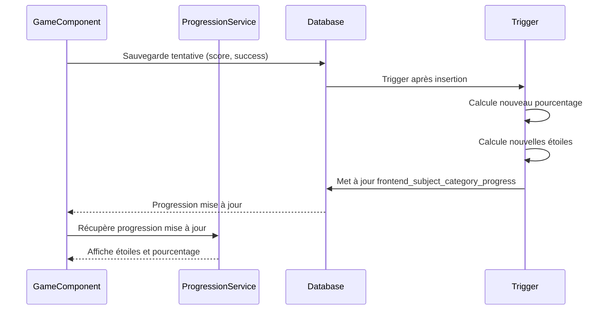

# Logique de progression

## Vue d'ensemble

La progression est suivie par **sous-catégorie** (subject category) et **matière principale** (subject) pour chaque enfant. Elle comprend :
- **Étoiles multiples** : Une étoile par complétion à 100% (pas de limite max)
- **Pourcentage de complétion** (0-100%) : Basé sur les jeux réussis
- **Statut de complétion** : `completed=true` si complétée
- **Compteur de complétions** : `completion_count` compte le nombre de fois qu'une matière/catégorie a été complétée

## Table de progression

### `frontend_subject_category_progress`

**Structure** :
```typescript
interface SubjectCategoryProgress {
  id: string;
  child_id: string;
  subject_category_id: string;
  completed: boolean;              // Catégorie complétée
  stars_count: number;             // Nombre total d'étoiles (égal à completion_count)
  completion_percentage: number;   // Pourcentage de complétion (0-100)
  completion_count: number;        // Nombre de fois complétée à 100%
  last_completed_at?: string;      // Date de la dernière complétion à 100%
  last_played_at?: string;         // Dernière date de jeu
  created_at: string;
  updated_at: string;
}
```

**Contraintes** : 
- `stars_count >= 0` (plus de limite max, une étoile par complétion)
- `completion_count >= 0`
- `completion_percentage` entre 0 et 100
- `stars_count = completion_count` (une étoile par complétion)

## Calcul du pourcentage de complétion

### Formule

```typescript
completion_percentage = (jeux réussis / total jeux) × 100
```

**Définitions** :
- **Jeu réussi** : Jeu avec meilleur score = 100%
- **Total jeux** : Nombre total de jeux dans la sous-catégorie

### Algorithme

1. **Récupérer tous les jeux** de la sous-catégorie
2. **Récupérer toutes les tentatives** de l'enfant pour ces jeux
3. **Calculer le meilleur score** pour chaque jeu
4. **Compter les jeux réussis** (meilleur score = 100%)
5. **Calculer le pourcentage** : `(jeux réussis / total jeux) × 100`

### Exemple d'implémentation

```typescript
async calculateCategoryCompletionPercentage(
  childId: string,
  subjectCategoryId: string
): Promise<number> {
  // 1. Récupérer tous les jeux de la catégorie
  const { data: games } = await supabase
    .from('games')
    .select('id')
    .eq('subject_category_id', subjectCategoryId);

  const totalGames = games?.length || 0;
  if (totalGames === 0) return 0;

  // 2. Récupérer les scores de tous les jeux pour cet enfant
  const gameIds = games.map(g => g.id);
  const { data: attempts } = await supabase
    .from('frontend_game_attempts')
    .select('game_id, score')
    .eq('child_id', childId)
    .in('game_id', gameIds);

  // 3. Calculer le meilleur score pour chaque jeu
  const gameBestScores = new Map<string, number>();
  attempts?.forEach(attempt => {
    const currentBest = gameBestScores.get(attempt.game_id) || 0;
    if (attempt.score > currentBest) {
      gameBestScores.set(attempt.game_id, attempt.score);
    }
  });

  // 4. Compter les jeux réussis (meilleur score = 100%)
  const completedGames = Array.from(gameBestScores.values())
    .filter(score => score === 100).length;
  
  // 5. Calculer le pourcentage
  return Math.round((completedGames / totalGames) * 100);
}
```

## Système d'étoiles multiples

### Vue d'ensemble

Le système d'étoiles a évolué pour permettre **plusieurs étoiles** par matière/sous-matière :
- **Une étoile par complétion** : Chaque fois qu'une matière/sous-matière atteint 100%, une nouvelle étoile est ajoutée
- **Pas de limite** : Le nombre d'étoiles peut dépasser 3 (contrairement à l'ancien système)
- **Réinitialisation** : Quand de nouveaux jeux sont ajoutés, l'enfant peut gagner une nouvelle étoile en complétant à nouveau

### Calcul des étoiles

**Formule** : `stars_count = completion_count`

- **`completion_count`** : Nombre de fois qu'une matière/sous-matière a été complétée à 100%
- **`stars_count`** : Nombre total d'étoiles (égal à `completion_count`)
- **Incrémentation** : Quand `completion_percentage` passe de < 100% à 100%, `completion_count` est incrémenté

### Détection d'une nouvelle complétion

Une nouvelle complétion est détectée quand :
1. `completion_percentage` passe de < 100% à 100%
2. Le nombre total de jeux a changé (nouveaux jeux ajoutés) OU
3. C'est la première fois que la matière/catégorie atteint 100%

**Logique** :
```typescript
// Dans ProgressionService.updateProgress()
const wasCompleted = existing.completion_percentage >= 100;
const isNowCompleted = newCompletionPercentage >= 100;
const isNewCompletion = !wasCompleted && isNowCompleted;

if (isNewCompletion) {
  completion_count = existing.completion_count + 1;
  stars_count = completion_count;
  last_completed_at = new Date();
}
```

### Table de progression des matières

#### `frontend_subject_progress`

Nouvelle table pour suivre la progression des **matières principales** (sans sous-catégories).

**Structure** :
```typescript
interface SubjectProgress {
  id: string;
  child_id: string;
  subject_id: string;
  completion_count: number;        // Nombre de fois complétée
  stars_count: number;              // Nombre total d'étoiles (égal à completion_count)
  completion_percentage: number;    // Pourcentage de complétion (0-100)
  last_completed_at?: string;       // Date de la dernière complétion
  last_played_at?: string;          // Dernière date de jeu
  created_at: string;
  updated_at: string;
}
```

**Contraintes** :
- `completion_count >= 0`
- `stars_count >= 0`
- `completion_percentage` entre 0 et 100
- UNIQUE `(child_id, subject_id)`

### Affichage des étoiles

**Composant** : `StarsDisplayComponent` (composant partagé)

**Localisation** : `projects/frontend/src/app/shared/components/stars-display/stars-display.component.ts`

**Fonctionnalités** :
- Affichage vertical des étoiles sur le côté droit des cartes
- Couleurs différentes : Or (#FFD700) pour sous-matières, Argent (#C0C0C0) pour matières
- Clignotement des nouvelles étoiles gagnées pendant la session

**Utilisation** :
```html
<!-- Pour les sous-matières -->
<app-stars-display 
  [count]="getCategoryStars(category.id)"
  [type]="'category'"
  [entityId]="category.id"
  color="gold"
  orientation="vertical"
  position="absolute"
  alignment="right">
</app-stars-display>

<!-- Pour les matières (somme matière + sous-matières) -->
<app-stars-display 
  [count]="getSubjectTotalStars(subject.id)"
  [type]="'subject'"
  [entityId]="subject.id"
  color="silver"
  orientation="vertical"
  position="absolute"
  alignment="right">
</app-stars-display>
```

### Calcul du total d'étoiles pour une matière

Pour une matière principale, le total d'étoiles = **étoiles de la matière + somme des étoiles de toutes ses sous-matières**.

```typescript
calculateSubjectTotalStars(subjectId: string): number {
  // Étoiles de la matière principale
  let totalStars = subjectProgress?.stars_count ?? 0;
  
  // Ajouter les étoiles des sous-matières
  categories.forEach(category => {
    if (category.progress) {
      totalStars += category.progress.stars_count ?? 0;
    }
  });
  
  return totalStars;
}
```

### Ancien système d'étoiles (déprécié)

L'ancien système calculait les étoiles selon le score et le taux de réussite (0-3 étoiles). Ce système est remplacé par le système d'étoiles multiples où une étoile = une complétion à 100%.

## Mise à jour de la progression

### Après chaque tentative

La progression est mise à jour automatiquement après chaque tentative de jeu :



### Service : ProgressionService

**Localisation** : `projects/frontend/src/app/core/services/progression/progression.service.ts`

**Méthodes principales** :

#### `updateProgress()`

Met à jour la progression d'une sous-catégorie :

```typescript
async updateProgress(
  childId: string,
  subjectCategoryId: string,
  updates: {
    completed?: boolean;
    starsCount?: number;
    completionPercentage?: number;
  }
): Promise<SubjectCategoryProgress>
```

**Logique** :
- Si progression existe → mise à jour
- Si progression n'existe pas → création
- Met à jour `last_played_at` automatiquement

#### `calculateCategoryCompletionPercentage()`

Calcule le pourcentage de complétion d'une sous-catégorie.

#### `calculateStars()`

Calcule les étoiles selon le score et le taux de réussite.

#### `isSubjectCategoryCompleted()`

Détermine si une sous-catégorie est complétée :

```typescript
isSubjectCategoryCompleted(progress: SubjectCategoryProgress): boolean {
  return progress.completed || progress.completion_percentage >= 100;
}
```

## Conditions de complétion

### Sous-catégorie complétée

Une sous-catégorie est considérée **complétée** si :
- `completed = true` OU
- `completion_percentage >= 100`

**Déblocage automatique** :
- Lorsque `completion_percentage` atteint 100%, `completed` peut être mis à `true` automatiquement
- Débloque les collectibles liés à la sous-catégorie
- Débloque le badge "Première catégorie complétée" (si première)

### Matière complétée

Une matière est considérée **complétée** si :
- Toutes les sous-catégories de la matière sont complétées (100%)
- La matière doit avoir au moins une sous-catégorie

**Déblocage automatique** :
- Débloque le badge "Première matière complétée" (si première)
- Débloque les jeux bonus liés à la matière

## Déblocage des collectibles

### Condition principale

Les collectibles sont débloqués automatiquement quand :
- Une sous-catégorie est complétée (`completion_percentage >= 100`)

### Structure de condition

Les collectibles ont un champ `unlock_condition_json` (JSONB) :

```json
{
  "type": "complete_subject_category",
  "subject_category_id": "uuid"
}
```

**Types de conditions** :
- `complete_subject_category` : Compléter une sous-catégorie spécifique
- `complete_subject` : Compléter une matière entière
- `earn_stars` : Obtenir un nombre d'étoiles total
- `play_games` : Jouer un nombre de jeux

## Déblocage des jeux bonus

### Condition principale

Les jeux bonus sont débloqués automatiquement quand :
- Toutes les sous-catégories d'une matière sont complétées

### Structure de condition

```json
{
  "type": "complete_subject",
  "subject_id": "uuid"
}
```

**Vérification** :
1. Récupérer toutes les sous-catégories de la matière
2. Vérifier que toutes ont `completion_percentage >= 100`
3. Si oui → débloquer le jeu bonus

## Affichage de la progression

### Composant : SubjectProgress

**Localisation** : `projects/frontend/src/app/shared/components/subject-progress/subject-progress.component.ts`

**Fonctionnalités** :
- Affichage des étoiles (0-3)
- Affichage du pourcentage de complétion
- Barre de progression visuelle
- Indicateur de complétion

### Composant : ProgressBar

**Localisation** : `projects/frontend/src/app/shared/components/progress-bar/progress-bar.component.ts`

**Fonctionnalités** :
- Barre de progression animée
- Affichage du pourcentage
- Couleurs selon le pourcentage (rouge < 50%, orange 50-80%, vert > 80%)

## Statistiques de progression

### Score total

Le score total est le nombre de jeux uniques réussis (meilleur score = 100%) :

```typescript
async calculateTotalScore(childId: string): Promise<number> {
  // Récupérer toutes les tentatives
  const { data: attempts } = await supabase
    .from('frontend_game_attempts')
    .select('game_id, score')
    .eq('child_id', childId);

  // Calculer le meilleur score pour chaque jeu
  const gameBestScores = new Map<string, number>();
  attempts?.forEach(attempt => {
    const currentBest = gameBestScores.get(attempt.game_id) || 0;
    if (attempt.score > currentBest) {
      gameBestScores.set(attempt.game_id, attempt.score);
    }
  });

  // Compter les jeux réussis (meilleur score = 100%)
  return Array.from(gameBestScores.values())
    .filter(score => score === 100).length;
}
```

### Jeux non réussis

Récupère les jeux échoués pour répétition intelligente :

```typescript
async getFailedGames(
  childId: string,
  subjectCategoryId: string
): Promise<string[]> {
  // Récupérer les tentatives échouées
  const { data: attempts } = await supabase
    .from('frontend_game_attempts')
    .select('game_id')
    .eq('child_id', childId)
    .eq('success', false)
    .order('completed_at', { ascending: false });

  // Filtrer par sous-catégorie
  const gameIds = attempts?.map(a => a.game_id) || [];
  const { data: games } = await supabase
    .from('games')
    .select('id')
    .eq('subject_category_id', subjectCategoryId);

  const categoryGameIds = games?.map(g => g.id) || [];
  return gameIds.filter(id => categoryGameIds.includes(id));
}
```

## Mise à jour automatique

### Triggers PostgreSQL

Les triggers PostgreSQL peuvent mettre à jour automatiquement la progression après chaque tentative :

```sql
-- Exemple de trigger (simplifié)
CREATE OR REPLACE FUNCTION update_progress_after_attempt()
RETURNS TRIGGER AS $$
DECLARE
  v_category_id UUID;
  v_completion_percentage INT;
BEGIN
  -- Récupérer la catégorie du jeu
  SELECT subject_category_id INTO v_category_id
  FROM games WHERE id = NEW.game_id;

  IF v_category_id IS NOT NULL THEN
    -- Calculer le nouveau pourcentage
    v_completion_percentage := calculate_completion_percentage(
      NEW.child_id,
      v_category_id
    );

    -- Mettre à jour la progression
    INSERT INTO frontend_subject_category_progress (
      child_id,
      subject_category_id,
      completion_percentage,
      last_played_at
    )
    VALUES (
      NEW.child_id,
      v_category_id,
      v_completion_percentage,
      NOW()
    )
    ON CONFLICT (child_id, subject_category_id)
    DO UPDATE SET
      completion_percentage = v_completion_percentage,
      last_played_at = NOW(),
      updated_at = NOW();
  END IF;

  RETURN NEW;
END;
$$ LANGUAGE plpgsql;

CREATE TRIGGER trigger_update_progress
AFTER INSERT ON frontend_game_attempts
FOR EACH ROW
EXECUTE FUNCTION update_progress_after_attempt();
```

## Bonnes pratiques

1. **Calculer après chaque tentative** : Mettre à jour la progression immédiatement
2. **Utiliser le meilleur score** : Un jeu est "réussi" si son meilleur score = 100%
3. **Arrondir le pourcentage** : Utiliser `Math.round()` pour éviter les décimales
4. **Gérer les cas limites** : Si `totalGames = 0`, retourner 0%
5. **Optimiser les requêtes** : Utiliser des index sur `child_id` et `subject_category_id`
6. **Cache** : Mettre en cache la progression pour éviter les recalculs fréquents

## Exemples de calcul

### Exemple 1 : Sous-catégorie avec 5 jeux

- Jeu 1 : Meilleur score = 100% ✅
- Jeu 2 : Meilleur score = 80% ❌
- Jeu 3 : Meilleur score = 100% ✅
- Jeu 4 : Meilleur score = 100% ✅
- Jeu 5 : Pas encore joué ❌

**Résultat** :
- Jeux réussis : 3
- Total jeux : 5
- Pourcentage : `(3 / 5) × 100 = 60%`
- Étoiles : 1 (passable, 60% ≥ 50%)

### Exemple 2 : Sous-catégorie complétée

- Jeu 1 : Meilleur score = 100% ✅
- Jeu 2 : Meilleur score = 100% ✅
- Jeu 3 : Meilleur score = 100% ✅

**Résultat** :
- Jeux réussis : 3
- Total jeux : 3
- Pourcentage : `(3 / 3) × 100 = 100%`
- Étoiles : 1 (première complétion)
- `completion_count` : 1
- Complétion : `completed = true` OU `completion_percentage >= 100`
- Déblocage : Collectibles et badges associés

### Exemple 3 : Nouvelle complétion après ajout de jeux

**Scénario** : L'enfant a complété une sous-matière (1 étoile). Le professeur ajoute 5 nouveaux jeux.

**État initial** :
- `completion_count` : 1
- `stars_count` : 1
- `completion_percentage` : 100%

**Après ajout de 5 nouveaux jeux** :
- `completion_percentage` : `(3 / 8) × 100 = 37.5%` (3 jeux complétés sur 8)
- `completion_count` : 1 (conservé, ne diminue jamais)
- `stars_count` : 1 (conservé)

**Après complétion des 5 nouveaux jeux** :
- `completion_percentage` : `(8 / 8) × 100 = 100%`
- `completion_count` : 2 (incrémenté car nouvelle complétion)
- `stars_count` : 2 (égal à completion_count)
- **Nouvelle étoile gagnée** : Animation dans le modal + clignotement dans les cartes
