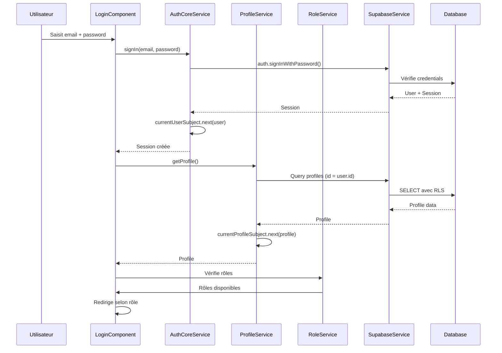
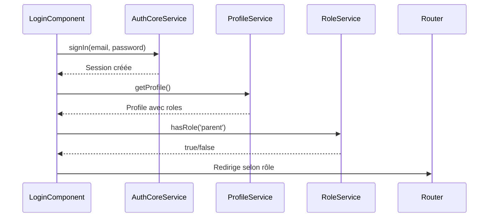

# Core Admin - Services Globaux et Authentification

## Rôle du dossier

Le dossier `core/` contient tous les services globaux, authentification et gestion de version utilisés dans l'application admin. Ces éléments sont disponibles dans toutes les features via l'injection de dépendances.

## Structure

```
core/
├── auth/                    # Authentification Supabase
│   ├── core/               # Service auth core
│   │   └── auth-core.service.ts
│   ├── profile/            # Gestion des profils
│   │   └── profile.service.ts
│   └── role/               # Gestion des rôles
│       └── role.service.ts
└── version.ts              # Gestion de version
```

## Services d'authentification

### AuthCoreService

**Localisation** : `auth/core/auth-core.service.ts`

**Rôle** : Gestion de base de l'authentification Supabase (session et état).

**Fonctionnalités** :
- Connexion via email/password
- Gestion de la session Supabase
- Observable `currentUser$` pour l'utilisateur actuel
- Écoute des changements d'état d'authentification

**Méthodes principales** :

#### `signIn()`

Connexion avec email et password :

```typescript
async signIn(email: string, password: string): Promise<SignInResult> {
  const { data, error } = await this.supabaseService.client.auth.signInWithPassword({
    email,
    password,
  });
  
  if (error) {
    return { session: null, error };
  }
  
  this.currentUserSubject.next(data.session.user);
  return { session: data.session, error: null };
}
```

#### `signOut()`

Déconnexion :

```typescript
async signOut(): Promise<void> {
  await this.supabaseService.client.auth.signOut();
  this.currentUserSubject.next(null);
}
```

#### `getCurrentUser()`

Récupère l'utilisateur actuel :

```typescript
getCurrentUser(): User | null {
  return this.currentUserSubject.value;
}
```

### ProfileService

**Localisation** : `auth/profile/profile.service.ts`

**Rôle** : Gestion des profils utilisateurs (récupération, mise à jour).

**Fonctionnalités** :
- Récupération du profil depuis `profiles`
- Observable `currentProfile$` pour le profil actuel
- Mise à jour du profil
- Cache pour éviter les requêtes multiples

**Méthodes principales** :

#### `getProfile()`

Récupère le profil de l'utilisateur connecté :

```typescript
async getProfile(): Promise<Profile | null> {
  const user = this.authCoreService.getCurrentUser();
  if (!user) return null;
  
  const { data, error } = await this.supabaseService.client
    .from('profiles')
    .select('*')
    .eq('id', user.id)
    .single();
  
  if (error) throw error;
  
  this.currentProfileSubject.next(data);
  return data;
}
```

**Structure du profil** :
```typescript
interface Profile {
  id: string;
  display_name: string | null;
  avatar_url: string | null;
  roles: string[];              // Tableau des rôles (ex: ['parent', 'prof'])
  metadata: Record<string, unknown> | null;
  created_at: string;
  updated_at: string;
}
```

### RoleService

**Localisation** : `auth/role/role.service.ts`

**Rôle** : Gestion des rôles utilisateurs (vérification, ajout).

**Fonctionnalités** :
- Vérification des rôles de l'utilisateur
- Ajout de rôle à un compte existant
- Gestion multi-rôles

**Méthodes principales** :

#### `hasRole()`

Vérifie si l'utilisateur a un rôle spécifique :

```typescript
hasRole(role: string): boolean {
  const profile = this.profileService.getCurrentProfile();
  return profile?.roles?.includes(role) ?? false;
}
```

#### `hasAnyRole()`

Vérifie si l'utilisateur a au moins un des rôles :

```typescript
hasAnyRole(roles: string[]): boolean {
  const profile = this.profileService.getCurrentProfile();
  return roles.some(role => profile?.roles?.includes(role)) ?? false;
}
```

## Gestion de version

### version.ts

**Localisation** : `core/version.ts`

**Rôle** : Gestion de la version de l'application.

**Fonctionnalités** :
- Version de l'application
- Affichage dans l'interface
- Injection via token `APP_VERSION`

**Utilisation** :
```typescript
// Dans app.config.ts
provide(APP_VERSION, { useValue: '0.184.0' })

// Dans un composant
private readonly version = inject(APP_VERSION);
```

## Flux d'authentification



## Guards

### authGuard

**Localisation** : `features/login/guards/auth.guard.ts`

**Rôle** : Vérifie l'authentification Supabase.

**Logique** :
1. Vérifie la session Supabase
2. Redirige vers `/login` si non authentifié

**Utilisation** :
```typescript
{
  path: 'dashboard',
  canActivate: [authGuard],
  loadComponent: () => import('./features/dashboard/dashboard.component')
}
```

### childParentGuard

**Localisation** : `features/child/guards/child-parent.guard.ts`

**Rôle** : Vérifie que l'enfant appartient au parent connecté.

**Logique** :
1. Récupère l'enfant depuis la route (`:id` ou `:childId`)
2. Vérifie la relation parent/enfant via RLS
3. Redirige si pas de relation

**Voir** : [docs/security.md](../../../../docs/security.md) pour les détails.

## Interactions entre services

### Flux typique : Après connexion



## Bonnes pratiques

1. **Séparation des responsabilités** : AuthCore (session), Profile (profil), Role (rôles)
2. **Observables** : Utiliser `currentUser$` et `currentProfile$` pour la réactivité
3. **Cache** : Éviter les requêtes multiples pour le profil
4. **Gestion d'erreurs** : Toujours gérer les erreurs d'authentification
5. **Vérification des rôles** : Utiliser `RoleService` pour vérifier les permissions

## Voir aussi

- [docs/architecture.md](../../../../docs/architecture.md) : Architecture complète
- [docs/security.md](../../../../docs/security.md) : Sécurité et authentification
- [shared/README.md](../shared/README.md) : Services partagés admin
