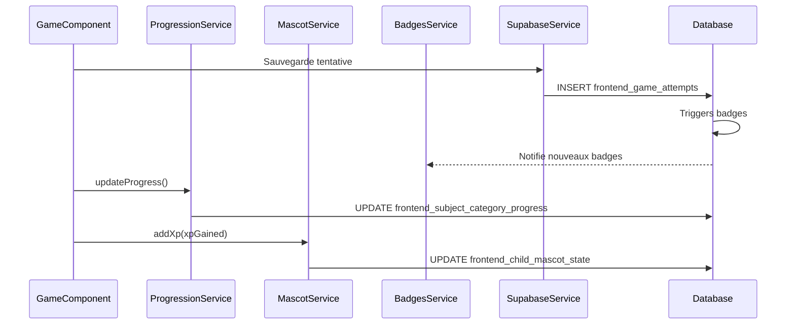

# Core - Services globaux et types

## Rôle du dossier

Le dossier `core/` contient tous les services globaux, types partagés, authentification et tokens d'injection utilisés dans toute l'application frontend. Ces éléments sont disponibles dans toutes les features via l'injection de dépendances.

## Structure

```
core/
├── auth/                    # Authentification enfant
│   ├── child-auth.service.ts      # Service d'authentification
│   └── child-auth.guard.ts        # Guard de protection des routes
├── services/                # Services métier globaux
│   ├── supabase/           # Service Supabase avec gestion d'erreurs
│   ├── badges/             # Services de badges
│   ├── progression/       # Calcul de progression
│   ├── mascot/            # Gestion de la mascotte
│   ├── adaptive-difficulty/ # Adaptation de la difficulté
│   ├── save/               # Sauvegarde automatique
│   ├── sync/               # Synchronisation
│   ├── sounds/             # Sons et feedback audio
│   ├── themes/             # Thèmes personnalisables
│   ├── tutorial/           # Tutoriel interactif
│   ├── statistics/         # Statistiques de l'enfant
│   ├── collection/         # Gestion de la collection
│   ├── bonus-games/        # Jeux bonus
│   └── cache/              # Cache en mémoire
├── types/                  # Types TypeScript partagés
│   ├── badge.types.ts      # Types de badges
│   ├── game.types.ts       # Types de jeux et progression
│   └── child-session.ts    # Session enfant
└── tokens/                 # Tokens d'injection (DI)
    └── environment.token.ts # Token pour environment
```

## Services principaux

### Authentification

**Service** : `ChildAuthService`  
**Localisation** : `core/auth/child-auth.service.ts`

**Rôle** : Gère l'authentification simplifiée des enfants via `firstname` + `login_pin`.

**Fonctionnalités** :
- Connexion enfant (firstname + PIN)
- Génération et gestion de JWT local
- Vérification de session (présence, expiration, validité)
- Mise à jour d'activité
- Déconnexion

**Voir** : [core/auth/README.md](auth/README.md) pour les détails complets.

### Supabase

**Service** : `SupabaseService`  
**Localisation** : `core/services/supabase/supabase.service.ts`

**Rôle** : Service central pour toutes les interactions avec Supabase.

**Fonctionnalités** :
- Création du client Supabase
- Interception des erreurs d'authentification (401/403)
- Ajout automatique du JWT aux requêtes
- Wrapper `executeWithErrorHandling()` pour gestion d'erreurs

**Utilisation** :
```typescript
// Dans Infrastructure
const { data, error } = await this.supabase.client
  .from('games')
  .select('*')
  .eq('subject_category_id', categoryId);
```

### Badges

**Services** :
- `BadgesService` : Gestion des badges, chargement, notifications
- `BadgeNotificationService` : Affichage des notifications de déblocage
- `BadgeDesignService` : Design et styles des badges

**Localisation** : `core/services/badges/`

**Voir** : [docs/badges-system.md](../../../../docs/badges-system.md) pour les détails.

### Progression

**Service** : `ProgressionService`  
**Localisation** : `core/services/progression/progression.service.ts`

**Rôle** : Calcul et mise à jour de la progression par sous-catégorie.

**Fonctionnalités** :
- Calcul du pourcentage de complétion
- Calcul des étoiles (0-3)
- Mise à jour de la progression
- Vérification de complétion

**Voir** : [docs/progression.md](../../../../docs/progression.md) pour les détails.

### Mascotte

**Service** : `MascotService`  
**Localisation** : `core/services/mascot/mascot.service.ts`

**Rôle** : Gestion de la mascotte (niveau, XP, évolution).

**Fonctionnalités** :
- Calcul du niveau selon l'XP
- Calcul du stade d'évolution
- Ajout d'XP après jeux réussis
- Mise à jour de l'apparence

**Voir** : [docs/gamification.md](../../../../docs/gamification.md) pour les détails.

### Adaptation de difficulté

**Service** : `AdaptiveDifficultyService`  
**Localisation** : `core/services/adaptive/adaptive-difficulty.service.ts`

**Rôle** : Adaptation de la difficulté des jeux selon les performances.

**Fonctionnalités** :
- Calcul du taux de réussite par jeu
- Calcul du niveau de difficulté optimal
- Suggestion de variantes de difficulté

### Sauvegarde

**Services** :
- `AutoSaveService` : Sauvegarde automatique périodique
- `CheckpointService` : Points de sauvegarde à des moments clés

**Localisation** : `core/services/save/`

**Fonctionnalités** :
- Sauvegarde automatique de l'état
- Reprise de session après fermeture
- Nettoyage des anciens checkpoints

### Synchronisation

**Service** : `SyncService`  
**Localisation** : `core/services/sync/sync.service.ts`

**Rôle** : Synchronisation périodique avec Supabase.

**Fonctionnalités** :
- Synchronisation des données locales
- Gestion des conflits
- Mise à jour incrémentale

### Sons

**Service** : `SoundService`  
**Localisation** : `core/services/sounds/sound.service.ts`

**Rôle** : Gestion des sons et feedback audio.

**Fonctionnalités** :
- Lecture de sons (succès, erreur, notification)
- Gestion du volume
- Activation/désactivation

### Thèmes

**Services** :
- `ThemesService` : Gestion des thèmes personnalisables
- `DynamicStylesService` : Application dynamique des styles

**Localisation** : `core/services/themes/`

**Fonctionnalités** :
- Chargement des thèmes disponibles
- Sélection de thème
- Application des styles dynamiques

### Tutoriel

**Service** : `TutorialService`  
**Localisation** : `core/services/tutorial/tutorial.service.ts`

**Rôle** : Gestion du tutoriel interactif pour les nouveaux utilisateurs.

**Fonctionnalités** :
- Affichage des étapes du tutoriel
- Suivi de la progression
- Désactivation après complétion

### Statistiques

**Service** : `StatisticsService`  
**Localisation** : `core/services/statistics/statistics.service.ts`

**Rôle** : Calcul des statistiques de l'enfant.

**Fonctionnalités** :
- Statistiques globales (taux de réussite, jeux joués, etc.)
- Statistiques par matière
- Statistiques par période

### Collection

**Service** : `CollectionService`  
**Localisation** : `core/services/collection/collection.service.ts`

**Rôle** : Gestion de la collection (badges, collectibles, thèmes).

**Fonctionnalités** :
- Chargement des collectibles disponibles et débloqués
- Vérification des conditions de déblocage
- Affichage de la collection

### Jeux bonus

**Service** : `BonusGamesService`  
**Localisation** : `core/services/bonus/bonus-games.service.ts`

**Rôle** : Gestion des jeux bonus.

**Fonctionnalités** :
- Chargement des jeux bonus disponibles et débloqués
- Vérification des conditions de déblocage
- Compteur de parties jouées

### Cache

**Service** : `CacheService`  
**Localisation** : `core/services/cache/cache.service.ts`

**Rôle** : Cache en mémoire avec expiration (TTL).

**Fonctionnalités** :
- Stockage de données avec TTL
- Récupération de données mises en cache
- Nettoyage automatique des entrées expirées

**Voir** : [docs/performance.md](../../../../docs/performance.md) pour les stratégies de cache.

## Types partagés

### game.types.ts

**Interfaces principales** :
- `Game` : Structure d'un jeu
- `GameAttempt` : Tentative de jeu
- `SubjectCategoryProgress` : Progression par sous-catégorie
- `GameVariant` : Variante de jeu avec difficulté
- `MascotState` : État de la mascotte
- `ChildStatistics` : Statistiques de l'enfant

**Utilisation** : Types utilisés dans toute l'application pour les jeux et la progression.

### badge.types.ts

**Interfaces principales** :
- `Badge` : Badge disponible
- `ChildBadge` : Badge débloqué par enfant
- `BadgeLevel` : Niveau de progression d'un badge
- `BadgeWithStatus` : Badge avec statut de déblocage
- `NewlyUnlockedBadge` : Badge nouvellement débloqué

**Types** :
- `BadgeType` : Union type des types de badges

**Utilisation** : Types utilisés pour le système de badges.

### child-session.ts

**Interfaces principales** :
- `ChildSession` : Session enfant avec JWT et données

**Utilisation** : Gestion de la session enfant.

## Tokens d'injection

### ENVIRONMENT

**Token** : `ENVIRONMENT`  
**Localisation** : `core/tokens/environment.token.ts`

**Rôle** : Injection de l'environment sans dépendance circulaire.

**Utilisation** :
```typescript
// Dans app.config.ts
provide(ENVIRONMENT, { useValue: environment })

// Dans un service
private readonly environment = inject(ENVIRONMENT);
```

## Interactions entre services

### Flux typique : Après un jeu



## Bonnes pratiques

1. **Services globaux** : Utiliser `providedIn: 'root'` pour les services core
2. **Types partagés** : Définir les types dans `types/` pour réutilisation
3. **Injection** : Utiliser `inject()` au lieu du constructeur
4. **Cache** : Utiliser `CacheService` pour les données fréquemment accédées
5. **Erreurs** : Toujours gérer les erreurs dans les services

## Voir aussi

- [core/auth/README.md](auth/README.md) : Authentification enfant
- [core/services/README.md](services/README.md) : Détails des services
- [docs/architecture.md](../../../../docs/architecture.md) : Architecture complète
- [docs/api.md](../../../../docs/api.md) : API et services Supabase
