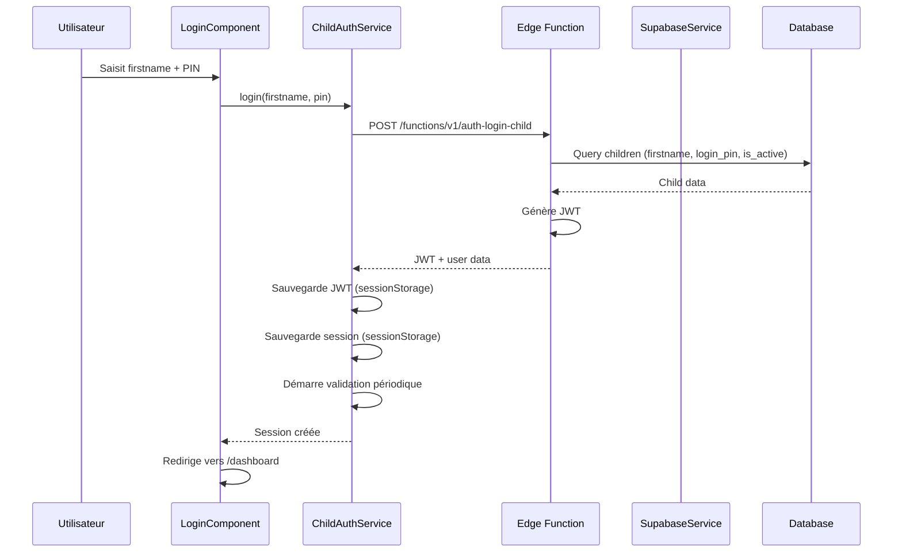

# Authentification Enfant

## Vue d'ensemble

L'authentification enfant utilise un système simplifié adapté aux enfants : connexion via **prénom** (`firstname`) + **code PIN** à 4 chiffres (`login_pin`), sans nécessiter d'email ou de mot de passe complexe.

## Service : ChildAuthService

**Localisation** : `core/auth/child-auth.service.ts`

**Rôle** : Gère l'authentification complète des enfants, de la connexion à la validation de session.

### Fonctionnalités principales

#### Connexion

**Méthode** : `login(firstname: string, pin: string)`

**Flux** :
1. Appel de l'Edge Function `auth-login-child` avec `firstname` et `pin`
2. Récupération du JWT et des données enfant
3. Sauvegarde du JWT dans `sessionStorage`
4. Création et sauvegarde de la session enfant
5. Démarrage de la validation périodique

**Sécurité** :
- Le PIN n'est jamais exposé en frontend (validation 100% backend)
- JWT généré par l'Edge Function Supabase
- Session stockée dans `sessionStorage` (supprimée à la fermeture du navigateur)

**Exemple** :
```typescript
const session = await childAuthService.login('Lucas', '1234');
// Session créée et sauvegardée
```

#### Déconnexion

**Méthode** : `logout()`

**Actions** :
1. Arrêt de la validation périodique
2. Nettoyage de toutes les données de session (`sessionStorage`)
3. Réinitialisation de l'état interne

**Exemple** :
```typescript
await childAuthService.logout();
// Session complètement nettoyée
```

#### Vérification de session

**Méthode** : `isSessionValid(): Promise<boolean>`

**Validations effectuées** :
1. Présence du token et de la session
2. Expiration absolue du JWT (vérification du payload)
3. Structure du JWT (3 parties séparées par des points)
4. Expiration relative (1h d'inactivité)
5. Expiration absolue depuis création (8h maximum)

**Double expiration** :
- **Relative** : 1h d'inactivité → session expirée
- **Absolue** : 8h depuis création → session expirée

**Exemple** :
```typescript
const isValid = await childAuthService.isSessionValid();
if (!isValid) {
  // Rediriger vers login
}
```

#### Mise à jour d'activité

**Méthode** : `updateActivity()`

**Rôle** : Met à jour le timestamp de dernière activité pour éviter l'expiration par inactivité.

**Appel automatique** :
- Lors de l'accès au token (`getAccessToken()`)
- Lors de la navigation (via guard)
- Lors des interactions utilisateur

#### Récupération de la session

**Méthode** : `getCurrentChild(): ChildSession | null`

**Retourne** : La session actuelle de l'enfant ou `null` si non authentifié.

**Structure de la session** :
```typescript
interface ChildSession {
  child_id: string;
  firstname: string;
  school_level?: string;
  parent_id: string;
  school_id?: string;
  avatar_url?: string;
  avatar_seed?: string;
  avatar_style?: string;
  createdAt: number;        // Timestamp de création
  lastActivity: number;     // Timestamp de dernière activité
}
```

#### Récupération du token

**Méthode** : `getAccessToken(): string | null`

**Rôle** : Retourne le JWT pour les requêtes Supabase.

**Comportement** :
- Met à jour l'activité automatiquement
- Version "safe" sans effets de bord (ne nettoie pas la session si invalide)
- Le nettoyage est géré par l'intercepteur d'erreurs Supabase (401/403)

## Guard : childAuthGuard

**Localisation** : `core/auth/child-auth.guard.ts`

**Rôle** : Protège toutes les routes nécessitant une session enfant valide.

### Logique

1. **Validation complète** : Appelle `isSessionValid()` pour une validation robuste
2. **Mise à jour d'activité** : Si session valide, met à jour l'activité (navigation = activité)
3. **Redirection** : Si session invalide, nettoie et redirige vers `/login` avec `reason=session_expired`

**Utilisation** :
```typescript
{
  path: '',
  canActivate: [childAuthGuard],  // Protection globale
  children: [/* routes protégées */]
}
```

## Edge Function : auth-login-child

**Localisation** : `supabase/functions/auth-login-child/`

**Rôle** : Génération sécurisée du JWT côté serveur.

**Endpoint** : `POST /functions/v1/auth-login-child`

**Body** :
```json
{
  "firstname": "Lucas",
  "pin": "1234"
}
```

**Response** :
```json
{
  "access_token": "eyJhbGciOiJIUzI1NiIsInR5cCI6IkpXVCJ9...",
  "expires_in": 28800,
  "user": {
    "id": "uuid",
    "firstname": "Lucas",
    "school_level": "P1",
    "parent_id": "uuid",
    "school_id": "uuid",
    "avatar_url": "https://...",
    "avatar_seed": "seed",
    "avatar_style": "fun-emoji"
  }
}
```

**Sécurité** :
- Validation du PIN côté serveur uniquement
- Génération du JWT avec secret Supabase
- Vérification que l'enfant est actif (`is_active = true`)

## Stockage de la session

### sessionStorage

**Clés utilisées** :
- `child_session` : Données de la session enfant (JSON)
- `child_auth_token` : JWT d'authentification
- `child_auth_expires_at` : Timestamp d'expiration du JWT

**Avantages** :
- Suppression automatique à la fermeture du navigateur
- Plus sécurisé que `localStorage` (pas persistant)
- Isolation par onglet

**Gestion des erreurs** :
- Try/catch pour gérer la navigation privée
- Nettoyage en cas d'erreur de stockage

## Validation périodique

### Validation automatique

**Fréquence** : Toutes les 10 minutes

**Méthode** : `validateSessionWithBackend()`

**Vérifications** :
1. L'enfant existe toujours dans la base de données
2. L'enfant est toujours actif (`is_active = true`)

**Comportement** :
- Si l'enfant est désactivé → déconnexion automatique
- Si erreur réseau → considérer comme valide (évite déconnexions intempestives)
- Si erreur 401/403 → géré par l'intercepteur Supabase

**Démarrage** :
- Automatique après connexion réussie
- Arrêt automatique lors de la déconnexion

## Flux d'authentification



## Gestion de l'expiration

### Double expiration

**Expiration relative (inactivité)** :
- Timeout : 1 heure
- Déclenchement : Aucune activité pendant 1h
- Mise à jour : Automatique lors des interactions

**Expiration absolue (durée)** :
- Timeout : 8 heures
- Déclenchement : 8h après création de la session
- Indépendant de l'activité

### Vérification dans le guard

Le guard vérifie les deux expirations :
```typescript
// Expiration relative (1h d'inactivité)
if (now - lastActivity > INACTIVITY_TIMEOUT) {
  // Session expirée par inactivité
  return false;
}

// Expiration absolue (8h depuis création)
if (now - createdAt > ABSOLUTE_TIMEOUT) {
  // Session expirée par durée absolue
  return false;
}
```

## Intégration avec SupabaseService

### Ajout automatique du JWT

Le `SupabaseService` intercepte les requêtes et ajoute automatiquement le JWT :

```typescript
// Dans SupabaseService.setupAuthInterceptor()
const authService = this.injector.get(ChildAuthService);
const token = authService.getAccessToken();

if (token) {
  const headers = new Headers(options.headers);
  headers.set('Authorization', `Bearer ${token}`);
  options.headers = headers;
}
```

### Gestion des erreurs 401/403

L'intercepteur d'erreurs Supabase gère automatiquement les erreurs d'authentification :
- 401 Unauthorized → Déconnexion automatique
- 403 Forbidden → Déconnexion automatique

## Bonnes pratiques

1. **Toujours utiliser `isSessionValid()`** dans les guards pour une validation complète
2. **Mettre à jour l'activité** lors des interactions utilisateur
3. **Gérer les erreurs de sessionStorage** (navigation privée)
4. **Nettoyer la session** en cas d'erreur ou d'expiration
5. **Valider périodiquement** avec le backend pour détecter les désactivations

## Exemples d'utilisation

### Connexion

```typescript
try {
  const session = await childAuthService.login('Lucas', '1234');
  console.log('Connecté:', session.firstname);
  router.navigate(['/dashboard']);
} catch (error) {
  console.error('Erreur de connexion:', error);
  // Afficher message d'erreur
}
```

### Vérification de session

```typescript
const isValid = await childAuthService.isSessionValid();
if (!isValid) {
  await childAuthService.logout();
  router.navigate(['/login'], { queryParams: { reason: 'session_expired' } });
}
```

### Récupération de l'enfant actuel

```typescript
const child = childAuthService.getCurrentChild();
if (child) {
  console.log('Enfant connecté:', child.firstname);
  console.log('Niveau scolaire:', child.school_level);
}
```

## Voir aussi

- [docs/security.md](../../../../docs/security.md) : Sécurité et authentification
- [docs/architecture.md](../../../../docs/architecture.md) : Architecture complète
- [core/README.md](../README.md) : Vue d'ensemble du dossier core
