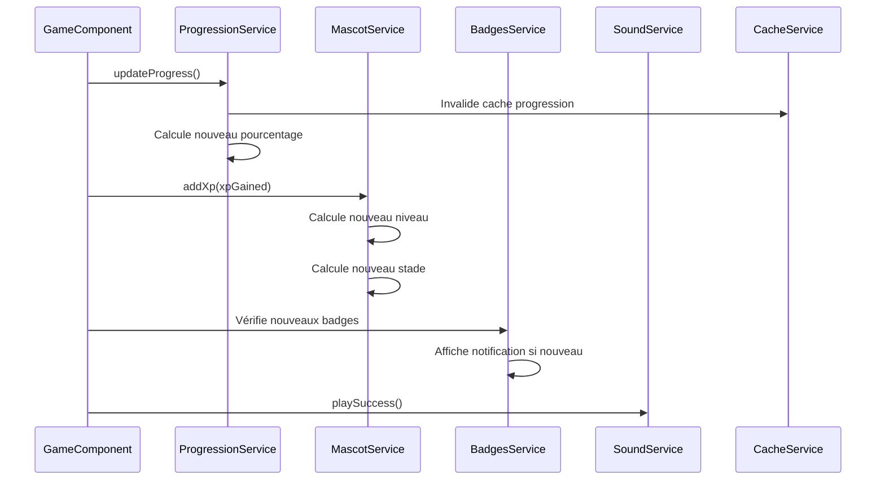
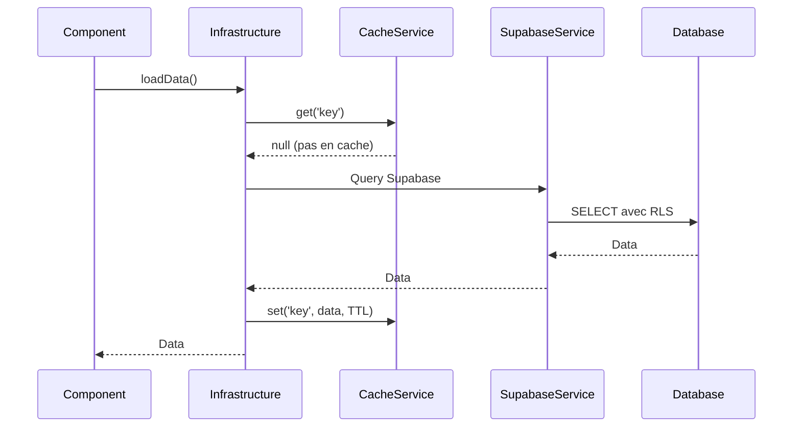

# Services Core - Liste et Rôles

## Vue d'ensemble

Le dossier `core/services/` contient tous les services métier globaux utilisés dans l'application frontend. Ces services sont injectables partout via `providedIn: 'root'`.

## Services par catégorie

### Services API et Infrastructure

#### SupabaseService

**Localisation** : `services/supabase/supabase.service.ts`

**Rôle** : Service central pour toutes les interactions avec Supabase.

**Fonctionnalités** :
- Création du client Supabase
- Interception des erreurs d'authentification (401/403)
- Ajout automatique du JWT aux requêtes (via `ChildAuthService`)
- Wrapper `executeWithErrorHandling()` pour gestion d'erreurs standardisée

**Utilisation** :
```typescript
// Dans Infrastructure
const { data, error } = await this.supabase.client
  .from('games')
  .select('*')
  .eq('subject_category_id', categoryId);
```

**Voir** : [docs/api.md](../../../../docs/api.md) pour les détails complets.

#### SupabaseErrorHandlerService

**Localisation** : `services/supabase/supabase-error-handler.service.ts`

**Rôle** : Gestion spécialisée des erreurs Supabase.

**Fonctionnalités** :
- Détection des erreurs d'authentification
- Gestion des erreurs 401/403
- Normalisation des erreurs

### Services de Gamification

#### BadgesService

**Localisation** : `services/badges/badges.service.ts`

**Rôle** : Gestion des badges (chargement, notifications).

**Fonctionnalités** :
- Chargement des badges disponibles
- Chargement des badges débloqués par enfant
- Vérification des nouveaux badges débloqués
- Notification des badges

**Voir** : [docs/badges-system.md](../../../../docs/badges-system.md) pour les détails.

#### BadgeNotificationService

**Localisation** : `services/badges/badge-notification.service.ts`

**Rôle** : Affichage des notifications de déblocage de badges.

**Fonctionnalités** :
- Affichage de modals avec animation
- Sons de notification (optionnel)
- Gestion de la file d'attente des notifications

#### BadgeDesignService

**Localisation** : `services/badges/badge-design.service.ts`

**Rôle** : Design et styles des badges.

**Fonctionnalités** :
- Génération de styles selon le type de badge
- Couleurs et icônes
- Affichage visuel

#### ProgressionService

**Localisation** : `services/progression/progression.service.ts`

**Rôle** : Calcul et mise à jour de la progression par sous-catégorie.

**Fonctionnalités** :
- Calcul du pourcentage de complétion
- Calcul des étoiles (0-3)
- Mise à jour de la progression
- Vérification de complétion
- Récupération des jeux non réussis

**Voir** : [docs/progression.md](../../../../docs/progression.md) pour les détails.

#### MascotService

**Localisation** : `services/mascot/mascot.service.ts`

**Rôle** : Gestion de la mascotte (niveau, XP, évolution).

**Fonctionnalités** :
- Calcul du niveau selon l'XP (formule : `floor(sqrt(xp / 100)) + 1`)
- Calcul du stade d'évolution (1-5)
- Ajout d'XP après jeux réussis (10-30 points)
- Mise à jour de l'apparence
- Création d'état par défaut si inexistant

**Voir** : [docs/gamification.md](../../../../docs/gamification.md) pour les détails.

### Services de Jeu

#### AdaptiveDifficultyService

**Localisation** : `services/adaptive/adaptive-difficulty.service.ts`

**Rôle** : Adaptation de la difficulté des jeux selon les performances.

**Fonctionnalités** :
- Calcul du taux de réussite par jeu
- Calcul du niveau de difficulté optimal (1-5)
- Suggestion de variantes de difficulté
- Historique des performances

**Logique** :
- Analyse les tentatives précédentes
- Calcule le taux de réussite moyen
- Propose la difficulté adaptée

### Services de Sauvegarde et Synchronisation

#### AutoSaveService

**Localisation** : `services/save/auto-save.service.ts`

**Rôle** : Sauvegarde automatique périodique de l'état de l'application.

**Fonctionnalités** :
- Sauvegarde automatique toutes les X secondes
- Sauvegarde avant fermeture du navigateur
- Gestion des états non sauvegardés
- Reprise après fermeture inattendue

#### CheckpointService

**Localisation** : `services/save/checkpoint.service.ts`

**Rôle** : Points de sauvegarde à des moments clés.

**Fonctionnalités** :
- Création de checkpoints (fin de jeu, fin de sous-catégorie)
- Récupération du dernier checkpoint
- Nettoyage des anciens checkpoints
- Types de checkpoints : `game_end`, `subject_category_end`

**Utilisation** :
```typescript
// Créer un checkpoint
await checkpointService.createCheckpoint({
  type: 'game_end',
  data: { gameId, score, state }
});

// Récupérer le dernier checkpoint
const checkpoint = await checkpointService.getLastCheckpoint();
```

#### SyncService

**Localisation** : `services/sync/sync.service.ts`

**Rôle** : Synchronisation périodique avec Supabase.

**Fonctionnalités** :
- Synchronisation des données locales
- Gestion des conflits
- Mise à jour incrémentale
- Détection des changements

### Services UI

#### SoundService

**Localisation** : `services/sounds/sound.service.ts`

**Rôle** : Gestion des sons et feedback audio.

**Fonctionnalités** :
- Lecture de sons (succès, erreur, notification)
- Gestion du volume
- Activation/désactivation
- Préchargement des sons

**Utilisation** :
```typescript
// Jouer un son de succès
soundService.playSuccess();

// Jouer un son d'erreur
soundService.playError();

// Jouer un son de notification
soundService.playNotification();
```

#### ThemesService

**Localisation** : `services/themes/themes.service.ts`

**Rôle** : Gestion des thèmes personnalisables.

**Fonctionnalités** :
- Chargement des thèmes disponibles
- Chargement des thèmes débloqués
- Sélection de thème
- Vérification des conditions de déblocage

**Voir** : [docs/gamification.md](../../../../docs/gamification.md) pour les détails.

#### DynamicStylesService

**Localisation** : `services/themes/dynamic-styles.service.ts`

**Rôle** : Application dynamique des styles selon le thème sélectionné.

**Fonctionnalités** :
- Injection de styles CSS dynamiques
- Application des couleurs et formes
- Mise à jour en temps réel

#### TutorialService

**Localisation** : `services/tutorial/tutorial.service.ts`

**Rôle** : Gestion du tutoriel interactif pour les nouveaux utilisateurs.

**Fonctionnalités** :
- Affichage des étapes du tutoriel
- Suivi de la progression
- Désactivation après complétion
- Reprise du tutoriel

### Services de Données

#### StatisticsService

**Localisation** : `services/statistics/statistics.service.ts`

**Rôle** : Calcul des statistiques de l'enfant.

**Fonctionnalités** :
- Statistiques globales (taux de réussite, jeux joués, etc.)
- Statistiques par matière
- Statistiques par période
- Agrégations et calculs

**Types retournés** :
```typescript
interface ChildStatistics {
  total_games_played: number;
  total_games_succeeded: number;
  success_rate: number;
  average_score: number;
  total_stars: number;
  // ...
}
```

#### CollectionService

**Localisation** : `services/collection/collection.service.ts`

**Rôle** : Gestion de la collection (badges, collectibles, thèmes).

**Fonctionnalités** :
- Chargement des collectibles disponibles et débloqués
- Vérification des conditions de déblocage
- Affichage de la collection
- Tri et filtrage

#### BonusGamesService

**Localisation** : `services/bonus/bonus-games.service.ts`

**Rôle** : Gestion des jeux bonus.

**Fonctionnalités** :
- Chargement des jeux bonus disponibles et débloqués
- Vérification des conditions de déblocage
- Compteur de parties jouées
- Mise à jour de `last_played_at`

### Services Utilitaires

#### CacheService

**Localisation** : `services/cache/cache.service.ts`

**Rôle** : Cache en mémoire avec expiration (TTL).

**Fonctionnalités** :
- Stockage de données avec TTL
- Récupération de données mises en cache
- Nettoyage automatique des entrées expirées
- Invalidation manuelle

**Utilisation** :
```typescript
// Stocker dans le cache (TTL: 10 minutes)
cacheService.set('subjects:child:123', subjects, 10 * 60 * 1000);

// Récupérer du cache
const cached = cacheService.get<Subject[]>('subjects:child:123');
if (cached) return cached;
```

**Stratégies** :
- Données statiques : TTL long (1 heure)
- Données dynamiques : TTL court (1-5 minutes)

**Voir** : [docs/performance.md](../../../../docs/performance.md) pour les stratégies de cache.

## Interactions entre services

### Flux typique : Après un jeu réussi



### Flux typique : Chargement des données



## Bonnes pratiques

### Injection de dépendances

**Utiliser `inject()`** :
```typescript
export class MyService {
  private readonly supabase = inject(SupabaseService);
  private readonly cache = inject(CacheService);
}
```

### Gestion d'erreurs

**Toujours gérer les erreurs** :
```typescript
try {
  const data = await this.supabase.client.from('table').select();
  if (data.error) throw data.error;
  return data.data;
} catch (error) {
  console.error('Erreur:', error);
  throw error;
}
```

### Cache

**Utiliser le cache pour les données fréquemment accédées** :
```typescript
const cacheKey = `subjects:child:${childId}`;
const cached = this.cache.get<Subject[]>(cacheKey);
if (cached) return cached;

// ... fetch data ...
this.cache.set(cacheKey, data, 10 * 60 * 1000);
```

### Performance

**Paralléliser les appels indépendants** :
```typescript
const [subjects, progress, badges] = await Promise.all([
  this.loadSubjects(childId),
  this.loadProgress(childId),
  this.loadBadges(childId),
]);
```

## Voir aussi

- [core/README.md](../README.md) : Vue d'ensemble du dossier core
- [docs/architecture.md](../../../../docs/architecture.md) : Architecture complète
- [docs/api.md](../../../../docs/api.md) : API et services Supabase
- [docs/performance.md](../../../../docs/performance.md) : Optimisations et cache
