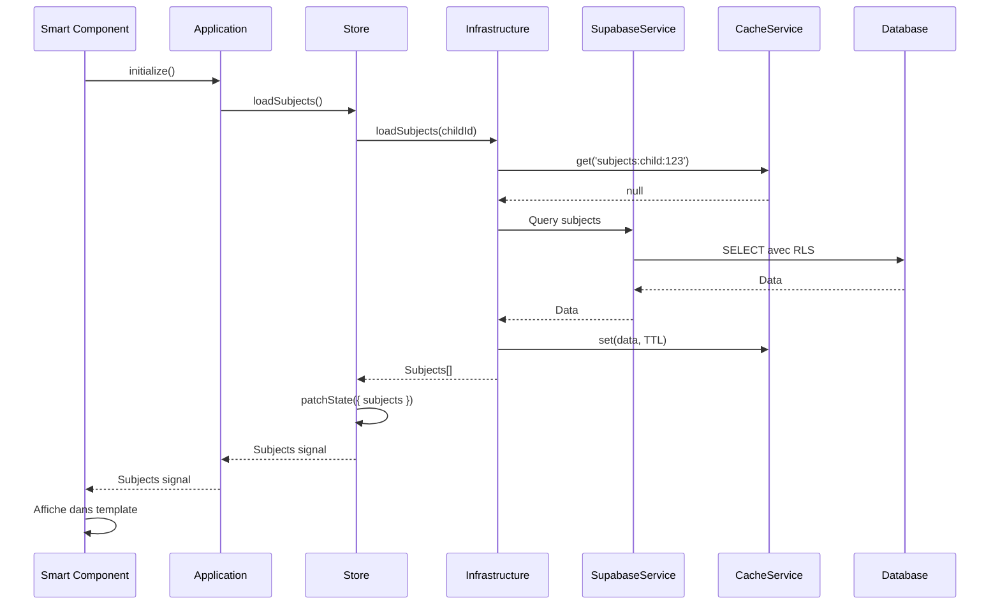

# Features - Pattern Smart Component

## Vue d'ensemble

Le dossier `features/` contient toutes les features autonomes de l'application frontend. Chaque feature suit le **pattern Smart Component** avec séparation Application/Infrastructure.

## Pattern Smart Component

### Structure standard

Chaque feature suit cette structure :

```
features/[feature-name]/
├── [feature].component.ts          # Smart Component (point d'entrée)
├── [feature].component.html         # Template
├── [feature].component.scss         # Styles
├── components/
│   ├── application/                 # Orchestration métier (Facade Pattern)
│   │   └── application.ts
│   └── infrastructure/              # Wrapper API (Adapter Pattern)
│       └── infrastructure.ts
├── store/                           # Store NgRx Signals
│   └── index.ts
├── services/                        # Services métier de la feature
│   └── [service-name]/
│       └── [service].service.ts
└── types/                           # Types TypeScript spécifiques
    └── [type].ts
```

### Responsabilités

#### Smart Component

**Rôle** : Point d'entrée de la feature, coordonne l'affichage et les interactions.

**Responsabilités** :
- Affichage de l'UI (template HTML)
- Injection des services (Application, Store)
- Gestion des événements utilisateur
- Navigation et routing

**Exemple** :
```typescript
@Component({
  selector: 'app-subjects',
  standalone: true,
  imports: [/* ... */],
  template: `<!-- ... -->`
})
export class SubjectsComponent {
  private readonly application = inject(SubjectsApplication);
  private readonly store = inject(SubjectsStore);

  readonly subjects = this.store.subjects;
  readonly loading = this.store.loading;

  async ngOnInit() {
    await this.application.initialize();
  }
}
```

#### Application (Orchestration métier)

**Rôle** : Orchestre la logique métier et simplifie l'interface pour le Smart Component.

**Pattern** : Facade Pattern

**Responsabilités** :
- Coordination du workflow de la feature
- Utilisation des méthodes du store
- Gestion de la logique métier complexe
- Simplification de l'interface pour le composant

**Exemple** :
```typescript
@Injectable({ providedIn: 'root' })
export class SubjectsApplication {
  private readonly store = inject(SubjectsStore);
  private readonly authService = inject(ChildAuthService);

  async initialize(): Promise<void> {
    const child = this.authService.getCurrentChild();
    if (child) {
      this.store.setChildId(child.child_id);
    }
    await this.store.loadSubjects();
  }

  async selectSubject(subjectId: string): Promise<void> {
    await this.store.selectSubject(subjectId);
    // Charger la progression pour les catégories
    const child = await this.authService.getCurrentChild();
    if (child) {
      const categories = this.store.categories();
      await this.store.loadProgress({ childId: child.child_id, categoryIds });
    }
  }

  getSubjects() {
    return this.store.subjects;
  }
}
```

#### Infrastructure (Wrapper API)

**Rôle** : Encapsule les appels Supabase et gère les erreurs.

**Pattern** : Adapter Pattern

**Responsabilités** :
- Appels Supabase via `SupabaseService`
- Gestion d'erreurs standardisée
- Transformation des données
- Cache via `CacheService`

**Exemple** :
```typescript
@Injectable({ providedIn: 'root' })
export class SubjectsInfrastructure {
  private readonly supabase = inject(SupabaseService);
  private readonly cache = inject(CacheService);

  async loadSubjects(childId: string): Promise<Subject[]> {
    const cacheKey = `subjects:child:${childId}`;
    const cached = this.cache.get<Subject[]>(cacheKey);
    if (cached) return cached;

    const { data, error } = await this.supabase.client
      .from('subjects')
      .select('*')
      .in('id', subjectIds);

    if (error) throw error;
    
    this.cache.set(cacheKey, data, 10 * 60 * 1000);
    return data || [];
  }
}
```

#### Store (NgRx Signals)

**Rôle** : Gestion d'état réactive avec NgRx Signals.

**Responsabilités** :
- État de la feature (signals)
- Valeurs calculées (computed signals)
- Actions et méthodes (rxMethod)

**Exemple** :
```typescript
export const SubjectsStore = signalStore(
  { providedIn: 'root' },
  withDevtools('subjects'),
  withState(initialState),
  withComputed((state) => ({
    hasSubjects: () => state.subjects().length > 0,
    selectedSubjectName: () => {
      const selected = state.selectedSubject();
      return selected?.name || null;
    },
  })),
  withMethods((store, infrastructure = inject(SubjectsInfrastructure)) => ({
    loadSubjects: rxMethod<void>(
      pipe(
        switchMap(() => infrastructure.loadSubjects(store.childId())),
        tap((subjects) => patchState(store, { subjects })),
        catchError((error) => {
          patchState(store, { error: error.message });
          return of(null);
        })
      )
    ),
  }))
);
```

## Liste des features

### Dashboard

**Localisation** : `features/dashboard/`

**Rôle** : Tableau de bord avec statistiques, récents collectibles, mascotte.

**Store** : `DashboardStore`

**Fonctionnalités** :
- Affichage des statistiques de l'enfant
- Collectibles récents débloqués
- Mascotte avec niveau et XP
- Barre de progression vers le prochain niveau

### Subjects

**Localisation** : `features/subjects/`

**Rôle** : Liste des matières et sous-catégories avec progression.

**Store** : `SubjectsStore`

**Fonctionnalités** :
- Affichage des matières activées pour l'enfant
- Sous-catégories avec étoiles et pourcentage
- Navigation vers les jeux
- Filtrage et recherche

### Game

**Localisation** : `features/game/`

**Rôle** : Interface de jeu interactive.

**Store** : `GameStore`

**Services** :
- `GameEngineService` : Logique de jeu
- `FeedbackService` : Messages de feedback
- `GameFeedbackMessageService` : Gestion des messages

**Fonctionnalités** :
- Chargement et affichage des jeux
- Gestion des différents types de jeux (QCM, Memory, Puzzle, etc.)
- Sauvegarde des tentatives
- Calcul des scores
- Feedback visuel et audio

**Voir** : [features/game/README.md](game/README.md) pour les détails.

### Collection

**Localisation** : `features/collection/`

**Rôle** : Collection de badges, collectibles et thèmes.

**Store** : `CollectionStore`

**Fonctionnalités** :
- Affichage des badges débloqués (avec niveaux)
- Affichage des collectibles débloqués
- Affichage des thèmes disponibles et débloqués
- Sélection de thème
- Tri et filtrage

### Settings

**Localisation** : `features/settings/`

**Rôle** : Paramètres de l'enfant.

**Store** : `SettingsStore`

**Fonctionnalités** :
- Sélection de thème
- Paramètres audio (volume, activation)
- Tutoriel (reprendre, désactiver)
- Informations de l'enfant

### Bonus Games

**Localisation** : `features/bonus-games/`

**Rôle** : Jeux bonus débloqués.

**Store** : `BonusGamesStore`

**Fonctionnalités** :
- Affichage des jeux bonus disponibles
- Affichage des jeux bonus débloqués
- Lancement des jeux bonus
- Compteur de parties jouées

### Badges

**Localisation** : `features/badges/`

**Rôle** : Affichage et gestion des badges.

**Store** : `BadgesStore`

**Fonctionnalités** :
- Affichage des badges disponibles
- Affichage des badges débloqués (avec niveaux)
- Notifications de nouveaux badges
- Détails des badges

**Voir** : [features/badges/README.md](badges/README.md) pour les détails.

### Login

**Localisation** : `features/login/`

**Rôle** : Connexion enfant.

**Fonctionnalités** :
- Formulaire de connexion (firstname + PIN)
- Gestion des erreurs
- Redirection après connexion

## Flux de données typique



## Stores NgRx Signals par feature

### DashboardStore

**État** :
- `statistics: ChildStatistics | null`
- `recentCollectibles: any[]`
- `loading: boolean`
- `error: string | null`

**Computed** :
- `hasStatistics: boolean`
- `successRatePercentage: number`

### SubjectsStore

**État** :
- `subjects: Subject[]`
- `selectedSubject: Subject | null`
- `categories: SubjectCategory[]`
- `progress: SubjectCategoryProgress[]`
- `loading: boolean`
- `error: string | null`

**Computed** :
- `hasSubjects: boolean`
- `selectedSubjectName: string | null`

### GameStore

**État** :
- `currentGame: Game | null`
- `gameState: GameState | null`
- `loading: boolean`
- `error: string | null`

**Computed** :
- `hasGame: boolean`
- `hasGameState: boolean`
- `currentQuestion: GameQuestion | null`
- `progress: number`

### CollectionStore

**État** :
- `badges: BadgeWithStatus[]`
- `collectibles: Collectible[]`
- `themes: Theme[]`
- `loading: boolean`
- `error: string | null`

### SettingsStore

**État** :
- `selectedTheme: Theme | null`
- `soundEnabled: boolean`
- `soundVolume: number`
- `loading: boolean`
- `error: string | null`

### BadgesStore

**État** :
- `availableBadges: Badge[]`
- `unlockedBadges: ChildBadge[]`
- `loading: boolean`
- `error: string | null`

### BonusGamesStore

**État** :
- `availableGames: BonusGame[]`
- `unlockedGames: BonusGameUnlock[]`
- `loading: boolean`
- `error: string | null`

## Routing

Toutes les features sont chargées en lazy loading :

```typescript
// app.routes.ts
{
  path: 'dashboard',
  loadComponent: () => import('./features/dashboard/dashboard.component').then(m => m.DashboardComponent),
},
{
  path: 'subjects',
  loadComponent: () => import('./features/subjects/subjects.component').then(m => m.SubjectsComponent),
},
{
  path: 'game/:id',
  loadComponent: () => import('./features/game/game.component').then(m => m.GameComponent),
},
```

**Avantages** :
- Réduction de la taille du bundle initial
- Chargement à la demande
- Meilleure performance

## Bonnes pratiques

### Création d'une nouvelle feature

1. **Créer la structure** :
   ```
   features/[feature-name]/
   ├── [feature].component.ts
   ├── components/
   │   ├── application/
   │   └── infrastructure/
   ├── store/
   ├── services/ (optionnel)
   └── types/ (optionnel)
   ```

2. **Implémenter le Smart Component** :
   - Injecter Application et Store
   - Utiliser les signals du store
   - Gérer les événements utilisateur

3. **Implémenter Application** :
   - Orchestrer la logique métier
   - Utiliser les méthodes du store
   - Simplifier l'interface pour le composant

4. **Implémenter Infrastructure** :
   - Encapsuler les appels Supabase
   - Gérer les erreurs
   - Utiliser le cache

5. **Implémenter le Store** :
   - Définir l'état initial
   - Créer les computed signals
   - Implémenter les méthodes avec rxMethod

6. **Ajouter la route** :
   - Lazy loading dans `app.routes.ts`
   - Protection avec guards si nécessaire

### Séparation des responsabilités

- **Smart Component** : UI uniquement
- **Application** : Logique métier
- **Infrastructure** : Appels API
- **Store** : État réactif

### Performance

- **Computed signals** : Pour les valeurs calculées
- **Cache** : Pour les données fréquemment accédées
- **Lazy loading** : Pour tous les composants
- **Parallélisation** : Pour les appels indépendants

## Voir aussi

- [docs/architecture.md](../../../../docs/architecture.md) : Architecture complète
- [features/game/README.md](game/README.md) : Détails de la feature Game
- [features/badges/README.md](badges/README.md) : Détails de la feature Badges
- [.cursor/rules/files-structures.mdc](../../../../.cursor/rules/files-structures.mdc) : Structure des fichiers
