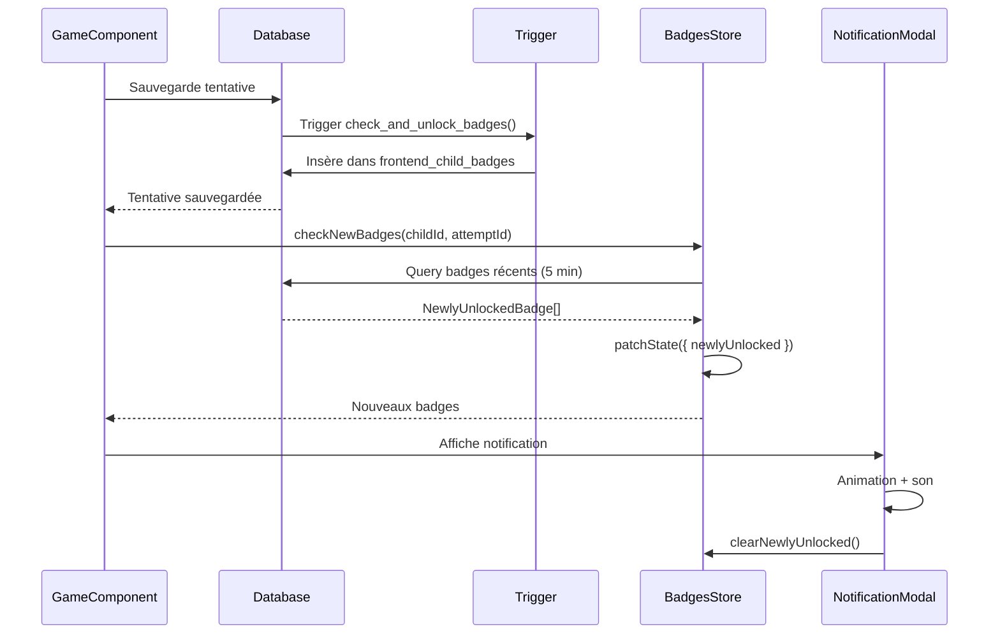

# Feature Badges - Système de Badges Frontend

## Vue d'ensemble

La feature Badges gère l'affichage et la notification des badges débloqués par les enfants. Les badges sont débloqués automatiquement via triggers PostgreSQL, et cette feature affiche les notifications et la collection.

## Structure

```
features/badges/
├── components/
│   ├── application/                # Orchestration métier
│   │   └── application.ts
│   └── infrastructure/             # Wrapper API
│       └── infrastructure.ts
└── store/
    └── index.ts                    # BadgesStore
```

## Store : BadgesStore

**Localisation** : `store/index.ts`

**État** :
```typescript
interface BadgesState {
  badges: Badge[];                  // Badges disponibles
  childBadges: ChildBadge[];        // Badges débloqués par l'enfant
  badgeLevels: BadgeLevel[];        // Niveaux de progression
  newlyUnlocked: NewlyUnlockedBadge[]; // Nouveaux badges débloqués
  loading: boolean;
  error: string | null;
}
```

**Computed signals** :
- `badgesWithStatus: BadgeWithStatus[]` : Badges avec statut (débloqué/verrouillé, niveau, valeur)
- `unlockedCount: number` : Nombre de badges débloqués
- `totalCount: number` : Nombre total de badges
- `completionPercentage: number` : Pourcentage de complétion (badges débloqués / total)

**Méthodes** :
- `loadBadges()` : Charge tous les badges disponibles
- `loadChildBadges(childId)` : Charge les badges débloqués et niveaux de l'enfant
- `checkNewBadges({ childId, gameAttemptId })` : Vérifie les nouveaux badges débloqués après une tentative
- `clearNewlyUnlocked()` : Réinitialise les nouveaux badges (après notification)

## Application : BadgesApplication

**Localisation** : `components/application/application.ts`

**Rôle** : Orchestre le chargement et la vérification des badges.

**Fonctionnalités** :
- Initialisation : Charge les badges disponibles et ceux de l'enfant
- Vérification des nouveaux badges après une tentative
- Affichage des notifications

## Infrastructure : BadgesInfrastructure

**Localisation** : `components/infrastructure/infrastructure.ts`

**Rôle** : Appels Supabase pour les badges.

**Méthodes principales** :

#### `loadAllBadges()`

Charge tous les badges actifs :

```typescript
async loadAllBadges(): Promise<Badge[]> {
  const { data, error } = await this.supabase.client
    .from('frontend_badges')
    .select('*')
    .eq('is_active', true)
    .order('name');
  
  if (error) throw error;
  return data || [];
}
```

#### `loadChildBadges()`

Charge les badges débloqués par un enfant :

```typescript
async loadChildBadges(childId: string): Promise<ChildBadge[]> {
  const { data, error } = await this.supabase.client
    .from('frontend_child_badges')
    .select(`
      *,
      frontend_badges(*)
    `)
    .eq('child_id', childId)
    .order('unlocked_at', { ascending: false });
  
  if (error) throw error;
  return data || [];
}
```

#### `loadBadgeLevels()`

Charge les niveaux de progression des badges :

```typescript
async loadBadgeLevels(childId: string): Promise<BadgeLevel[]> {
  const { data, error } = await this.supabase.client
    .from('frontend_badge_levels')
    .select('*')
    .eq('child_id', childId);
  
  if (error) throw error;
  return data || [];
}
```

#### `checkNewBadges()`

Vérifie les nouveaux badges débloqués après une tentative :

```typescript
async checkNewBadges(
  childId: string,
  gameAttemptId: string
): Promise<NewlyUnlockedBadge[]> {
  // Les badges sont débloqués automatiquement via triggers PostgreSQL
  // Cette méthode vérifie les nouveaux badges débloqués depuis la dernière vérification
  
  // Récupérer les badges débloqués récemment (dernières 5 minutes)
  const fiveMinutesAgo = new Date(Date.now() - 5 * 60 * 1000).toISOString();
  
  const { data, error } = await this.supabase.client
    .from('frontend_child_badges')
    .select(`
      *,
      frontend_badges(*)
    `)
    .eq('child_id', childId)
    .gte('unlocked_at', fiveMinutesAgo)
    .order('unlocked_at', { ascending: false });
  
  if (error) throw error;
  
  // Transformer en NewlyUnlockedBadge
  return (data || []).map(cb => ({
    badge_id: cb.badge_id,
    badge_name: cb.frontend_badges.name,
    badge_type: cb.frontend_badges.badge_type,
    level: cb.level,
    value: cb.value,
    unlocked_at: cb.unlocked_at,
  }));
}
```

## Notification des badges

### BadgeNotificationModal

**Localisation** : `shared/components/badge-notification-modal/`

**Rôle** : Modal avec animation pour afficher les nouveaux badges débloqués.

**Fonctionnalités** :
- Animation de célébration (confettis)
- Affichage du badge avec icône et couleur
- Message de félicitations
- Bouton de fermeture

**Utilisation** :
```typescript
// Dans le composant
@if (newlyUnlockedBadges().length > 0) {
  <app-badge-notification-modal
    [badge]="newlyUnlockedBadges()[0]"
    (close)="onBadgeNotificationClose()"
  />
}
```

### BadgeVisual

**Localisation** : `shared/components/badge-visual/`

**Rôle** : Affichage visuel d'un badge.

**Fonctionnalités** :
- Icône selon le type de badge
- Couleur selon le type
- Affichage du niveau et de la valeur
- Indicateur de déblocage/verrouillage

## Flux de déblocage et notification



## Affichage dans la collection

### Badges avec statut

Le computed signal `badgesWithStatus` combine les badges disponibles avec les badges débloqués :

```typescript
badgesWithStatus: (): BadgeWithStatus[] => {
  const badges = state.badges();
  const childBadges = state.childBadges();
  const badgeLevels = state.badgeLevels();

  return badges.map((badge) => {
    // Trouver le badge débloqué le plus récent pour ce type
    const unlockedBadge = childBadges
      .filter((cb) => cb.badge_id === badge.id)
      .sort((a, b) => new Date(b.unlocked_at).getTime() - new Date(a.unlocked_at).getTime())[0];

    // Trouver le niveau actuel pour ce type de badge
    const badgeLevel = badgeLevels.find((bl) => bl.badge_type === badge.badge_type);

    return {
      ...badge,
      isUnlocked: !!unlockedBadge,
      unlockedAt: unlockedBadge?.unlocked_at,
      level: unlockedBadge?.level,
      value: unlockedBadge?.value,
      currentThreshold: badgeLevel ? badgeLevel.current_level : 1,
    } as BadgeWithStatus;
  });
}
```

**Utilisation** :
```typescript
// Dans le composant Collection
readonly badges = computed(() => this.badgesStore.badgesWithStatus());

// Dans le template
@for (badge of badges(); track badge.id) {
  <app-badge-visual
    [badgeType]="badge.badge_type"
    [isUnlocked]="badge.isUnlocked"
    [level]="badge.level"
    [value]="badge.value"
  />
}
```

## Intégration avec les autres features

### Après une tentative de jeu

**Dans GameComponent** :
```typescript
// Après sauvegarde de la tentative
await this.gameStore.saveAttempt(attempt);

// Vérifier les nouveaux badges
await this.badgesStore.checkNewBadges({
  childId: child.child_id,
  gameAttemptId: attempt.id
});

// Afficher les notifications
const newlyUnlocked = this.badgesStore.newlyUnlocked();
if (newlyUnlocked.length > 0) {
  // Afficher la modal de notification
}
```

### Dans la collection

**Dans CollectionComponent** :
```typescript
// Charger les badges au démarrage
async ngOnInit() {
  await this.badgesStore.loadBadges();
  const child = this.authService.getCurrentChild();
  if (child) {
    await this.badgesStore.loadChildBadges(child.child_id);
  }
}

// Afficher les badges avec statut
readonly badges = computed(() => this.badgesStore.badgesWithStatus());
```

## Types de badges

Voir [docs/badges-system.md](../../../../docs/badges-system.md) pour la liste complète des types de badges :

- `first_category_complete` : Première catégorie complétée
- `first_subject_complete` : Première matière complétée
- `first_game_perfect` : Premier jeu parfait du 1er coup
- `daily_streak_responses` : Réponses quotidiennes (5+ ou 7+)
- `consecutive_correct` : Réponses consécutives correctes (5 ou 7)
- `perfect_games_count` : Jeux parfaits cumulatifs (10 ou 13)

## Bonnes pratiques

1. **Vérifier les nouveaux badges** après chaque tentative de jeu
2. **Afficher les notifications** de manière non intrusive
3. **Recharger les badges** après vérification pour mettre à jour l'état
4. **Utiliser les computed signals** pour les badges avec statut
5. **Gérer les erreurs** lors du chargement des badges

## Voir aussi

- [docs/badges-system.md](../../../../docs/badges-system.md) : Système de badges complet
- [docs/gamification.md](../../../../docs/gamification.md) : Gamification et récompenses
- [features/README.md](../README.md) : Pattern Smart Component
- [core/services/badges/](../core/services/badges/) : Services de badges globaux
