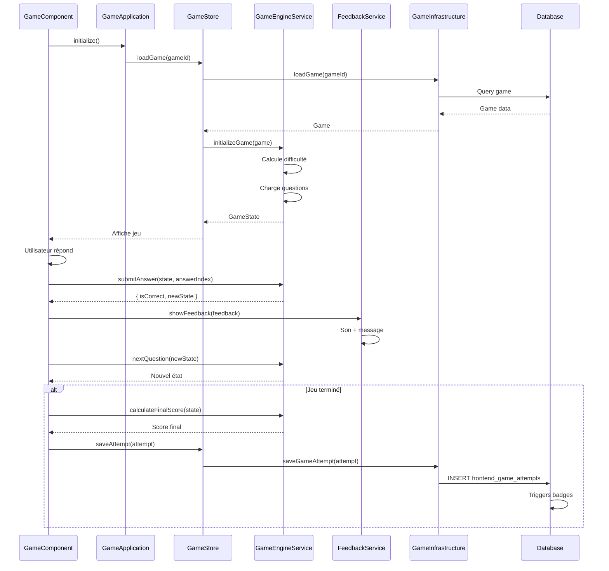

# Feature Game - Interface de Jeu

## Vue d'ensemble

La feature Game gère l'interface interactive de jeu pour tous les types de jeux éducatifs. Elle charge le jeu, gère l'état de jeu, valide les réponses, calcule les scores et sauvegarde les tentatives.

## Structure

```
features/game/
├── game.component.ts              # Smart Component
├── game.component.html             # Template principal
├── game.component.scss             # Styles
├── components/
│   ├── application/                # Orchestration métier
│   │   └── application.ts
│   ├── infrastructure/             # Wrapper API
│   │   └── infrastructure.ts
│   └── game-feedback-message/     # Composant de feedback
│       └── game-feedback-message.component.ts
├── services/
│   ├── game-engine.service.ts      # Logique de jeu
│   ├── feedback.service.ts         # Messages de feedback
│   └── game-feedback-message.service.ts # Gestion des messages
├── store/
│   └── index.ts                    # GameStore
└── types/
    └── game.types.ts               # Types spécifiques au jeu
```

## Smart Component : GameComponent

**Localisation** : `game.component.ts`

**Rôle** : Point d'entrée de la feature, coordonne l'affichage et les interactions.

**Fonctionnalités** :
- Chargement du jeu depuis la route (`:id`)
- Affichage selon le type de jeu (QCM, Memory, Puzzle, etc.)
- Gestion des interactions utilisateur
- Sauvegarde des tentatives
- Affichage des résultats

**Computed signals** :
- `gameType` : Type de jeu normalisé
- `normalizedGameType` : Type normalisé pour comparaison
- `isQcmGame`, `isMemoryGame`, etc. : Vérifications de type
- `gameData` : Données du jeu selon le type

## Services métier

### GameEngineService

**Localisation** : `services/game-engine.service.ts`

**Rôle** : Logique de jeu (initialisation, validation, progression).

**Méthodes principales** :

#### `initializeGame()`

Initialise une session de jeu avec adaptation de la difficulté :

```typescript
async initializeGame(game: Game, variant?: GameVariant): Promise<GameState> {
  // 1. Récupérer l'enfant
  const child = await this.authService.getCurrentChild();
  
  // 2. Calculer la difficulté selon les performances
  const successRate = await this.adaptiveService.getSuccessRateForGame(child.child_id, game.id);
  const difficultyLevel = this.adaptiveService.calculateDifficultyLevel(successRate);
  
  // 3. Charger les questions
  const questions = await this.loadQuestions(game, variant, difficultyLevel);
  
  // 4. Retourner l'état initial
  return {
    currentQuestionIndex: 0,
    questions,
    selectedAnswer: null,
    score: 0,
    isCompleted: false,
    startedAt: new Date(),
  };
}
```

#### `submitAnswer()`

Soumet une réponse et calcule si elle est correcte :

```typescript
submitAnswer(state: GameState, answerIndex: number): { isCorrect: boolean; newState: GameState } {
  const currentQuestion = state.questions[state.currentQuestionIndex];
  const isCorrect = answerIndex === currentQuestion.correctAnswer;
  
  const newState: GameState = {
    ...state,
    selectedAnswer: answerIndex,
    score: isCorrect ? state.score + 1 : state.score,
  };
  
  return { isCorrect, newState };
}
```

#### `nextQuestion()`

Passe à la question suivante :

```typescript
nextQuestion(state: GameState): GameState {
  const nextIndex = state.currentQuestionIndex + 1;
  const isCompleted = nextIndex >= state.questions.length;
  
  return {
    ...state,
    currentQuestionIndex: nextIndex,
    selectedAnswer: null,
    isCompleted,
    completedAt: isCompleted ? new Date() : undefined,
  };
}
```

#### `calculateFinalScore()`

Calcule le score final en pourcentage :

```typescript
calculateFinalScore(state: GameState): number {
  if (state.questions.length === 0) return 0;
  return Math.round((state.score / state.questions.length) * 100);
}
```

### FeedbackService

**Localisation** : `services/feedback.service.ts`

**Rôle** : Génération et affichage des messages de feedback.

**Méthodes principales** :

#### `generateFeedback()`

Génère un feedback pour une réponse :

```typescript
generateFeedback(isCorrect: boolean, explanation?: string): FeedbackData {
  const messages = isCorrect
    ? ['Bravo ! 🎉', 'Excellent ! ⭐', 'Super ! 👍', ...]
    : ['Pas tout à fait 😊', 'Presque ! 💪', 'Essaie encore ! 🔄', ...];
  
  const randomMessage = messages[Math.floor(Math.random() * messages.length)];
  
  return {
    isCorrect,
    message: randomMessage,
    explanation,
  };
}
```

#### `showFeedback()`

Affiche le feedback (sonore et visuel) :

```typescript
showFeedback(feedback: FeedbackData): void {
  if (feedback.isCorrect) {
    this.soundService.playSuccessSound();
  } else {
    this.soundService.playFailureSound();
  }
}
```

#### `showGameCompleteFeedback()`

Affiche le feedback de fin de jeu :

```typescript
showGameCompleteFeedback(score: number, totalQuestions: number): FeedbackData {
  const percentage = Math.round((score / totalQuestions) * 100);
  let message = '';
  
  if (percentage === 100) {
    message = 'Parfait ! Tu as tout réussi ! 🏆';
  } else if (percentage >= 80) {
    message = `Excellent ! ${score}/${totalQuestions} bonnes réponses ! ⭐`;
  } else if (percentage >= 60) {
    message = `Bien joué ! ${score}/${totalQuestions} bonnes réponses ! 👍`;
  } else {
    message = `Continue ! ${score}/${totalQuestions} bonnes réponses. Tu peux réessayer ! 💪`;
  }
  
  this.soundService.playUnlockSound();
  return { isCorrect: percentage >= 60, message };
}
```

### GameFeedbackMessageService

**Localisation** : `services/game-feedback-message.service.ts`

**Rôle** : Gestion des messages de feedback avec personnalisation selon le type de jeu.

**Fonctionnalités** :
- Messages personnalisés selon le type de jeu
- Gestion de la file d'attente des messages
- Affichage avec animations

## Store : GameStore

**Localisation** : `store/index.ts`

**État** :
```typescript
interface GameStoreState {
  currentGame: Game | null;
  gameState: GameState | null;
  loading: boolean;
  error: string | null;
}
```

**Computed signals** :
- `hasGame: boolean` : Jeu chargé
- `hasGameState: boolean` : État de jeu initialisé
- `currentQuestion: GameQuestion | null` : Question actuelle
- `progress: number` : Pourcentage de progression (0-100)

**Méthodes** :
- `loadGame(gameId: string)` : Charge un jeu
- `setGameState(gameState: GameState)` : Définit l'état de jeu
- `saveAttempt(attempt: Partial<GameAttempt>)` : Sauvegarde une tentative

## Types

### GameState

**Localisation** : `types/game.types.ts`

```typescript
interface GameState {
  currentQuestionIndex: number;
  questions: GameQuestion[];
  selectedAnswer: number | null;
  score: number;
  isCompleted: boolean;
  startedAt: Date;
  completedAt?: Date;
}
```

### GameQuestion

```typescript
interface GameQuestion {
  id: string;
  question: string;
  answers: string[];
  correctAnswer: number;
  explanation?: string;
}
```

### GameSession

```typescript
interface GameSession {
  game: Game;
  state: GameState;
  difficultyLevel: number;
}
```

## Flux de jeu typique



## Types de jeux supportés

La feature Game supporte tous les types de jeux définis dans [docs/game-types.md](../../../../docs/game-types.md) :

- **QCM** : Questions à choix multiples
- **Memory** : Jeu de mémoire (paires)
- **Puzzle** : Puzzle à reconstituer
- **Chronologie** : Remettre les événements dans l'ordre
- **Vrai/Faux** : Questions vrai ou faux
- **Liens** : Relier les mots aux réponses
- **Case vide** : Compléter les cases vides
- **Simon** : Répéter la séquence
- **Image interactive** : Cliquer sur les zones correctes
- **Réponse libre** : Saisie libre de texte

**Voir** : [docs/game-types.md](../../../../docs/game-types.md) pour les détails de chaque type.

## Sauvegarde des tentatives

### Structure d'une tentative

```typescript
interface GameAttempt {
  child_id: string;
  game_id: string;
  success: boolean;              // score === 100
  score: number;                 // 0-100
  duration_ms: number;           // Durée en millisecondes
  responses_json: Record<string, unknown>;  // Réponses de l'enfant
  difficulty_level: number;       // Niveau de difficulté utilisé
  started_at: string;
  completed_at: string;
}
```

### Sauvegarde

**Via Infrastructure** :
```typescript
async saveGameAttempt(attempt: Partial<GameAttempt>): Promise<void> {
  const { error } = await this.supabase.client
    .from('frontend_game_attempts')
    .insert(attempt);
  
  if (error) throw error;
}
```

**Déclenchement automatique** :
- Triggers PostgreSQL pour badges
- Mise à jour de la progression
- Calcul de l'XP de la mascotte

## Adaptation de la difficulté

### Calcul de la difficulté

**Service** : `AdaptiveDifficultyService`

**Logique** :
1. Récupère le taux de réussite pour le jeu
2. Calcule le niveau de difficulté optimal (1-5)
3. Charge la variante correspondante si disponible

**Exemple** :
```typescript
const successRate = await adaptiveService.getSuccessRateForGame(childId, gameId);
const difficultyLevel = adaptiveService.calculateDifficultyLevel(successRate);
// difficultyLevel: 1 (facile) à 5 (très difficile)
```

## Feedback et récompenses

### Après chaque réponse

1. **Feedback immédiat** : Message, son, animation
2. **Mise à jour du score** : Incrémentation si correct
3. **Progression** : Passage à la question suivante

### Après le jeu

1. **Score final** : Calcul et affichage
2. **Feedback de fin** : Message selon le score
3. **Sauvegarde** : Tentative enregistrée
4. **Récompenses** :
   - XP pour la mascotte (si réussi)
   - Mise à jour de la progression
   - Déblocage de badges (via triggers)
   - Déblocage de collectibles (si catégorie complétée)

## Composants UI spécifiques

### GameFeedbackMessageComponent

**Localisation** : `components/game-feedback-message/game-feedback-message.component.ts`

**Rôle** : Affichage des messages de feedback avec animations.

**Fonctionnalités** :
- Messages personnalisés selon le type de jeu
- Animations d'apparition/disparition
- Affichage des explications

## Bonnes pratiques

1. **Toujours initialiser le jeu** via `GameEngineService.initializeGame()`
2. **Valider les réponses** via `submitAnswer()` avant de passer à la suivante
3. **Sauvegarder les tentatives** même en cas d'échec
4. **Gérer les erreurs** de chargement et de sauvegarde
5. **Adapter la difficulté** selon les performances
6. **Afficher le feedback** pour chaque réponse

## Voir aussi

- [docs/game-types.md](../../../../docs/game-types.md) : Types de jeux et structures
- [docs/progression.md](../../../../docs/progression.md) : Calcul de progression
- [docs/gamification.md](../../../../docs/gamification.md) : XP et récompenses
- [features/README.md](../README.md) : Pattern Smart Component
